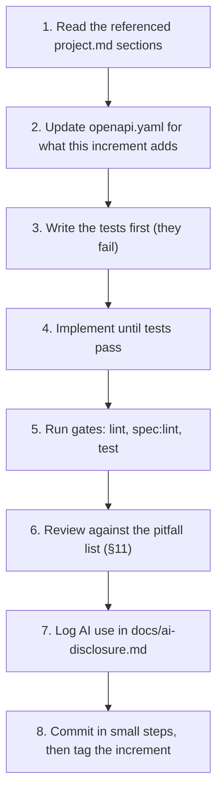

# SLSEA Real-Time Solar Generation Data API: Implementation Plan

> **Source of truth.** `project.md` defines *what* is built; this plan defines *in what order and how*. If this plan and `project.md` ever disagree, `project.md` wins: stop, record the conflict in `docs/ai-disclosure.md`, and follow `project.md`. Section references (`§`) point to `project.md`.

---

## 0. Working Rules

### 0.1 Increment order

Work through increments **I0 → I10 strictly in order**. Each increment builds only on earlier ones and ends in a runnable, tested, committed and tagged state. Never start an increment while the previous one has failing tests or lint errors.

```mermaid
flowchart LR
    I0["I0 Foundations"] --> I1["I1 Data layer"]
    I1 --> I2["I2 Authentication & policy"]
    I2 --> I3["I3 Hierarchy read path"]
    I3 --> I4["I4 Readings history"]
    I4 --> I5["I5 Operational reads"]
    I5 --> I6["I6 Device ingestion"]
    I6 --> I7["I7 Regional summaries & freshness"]
    I7 --> I8["I8 Generation trends"]
    I8 --> I9["I9 Account & password management"]
    I9 --> I10["I10 Hardening & completion"]
```



### 0.2 Workflow inside every increment



### 0.3 Definition of done (applies to every increment)

- [ ] `npm run lint`, `npm run spec:lint` and `npm test` pass locally and in CI.
- [ ] Every operation added is in `openapi.yaml` with success + all applicable error responses, headers, examples and required scope (§8).
- [ ] Every failure returns the uniform error body (§4.7); no ad-hoc error shapes.
- [ ] No secret, token or hash in any response, log or committed file (§5.6).
- [ ] The pitfall checklist (§11) was applied to all generated code; faults found are repaired, not left in place.
- [ ] `docs/ai-disclosure.md` has an entry for each unit generated with AI (prompt, faults found, repair, commit hash).
- [ ] Commits are small, use Conventional Commits, and the increment is tagged (`i<N>-<name>`).
- [ ] `README.md` is updated if scripts, env vars or setup changed.

### 0.4 Conventions

| Topic | Rule |
|---|---|
| Module format | Decide once in I0 from the pinned Prisma version's requirements: ESM (`"type": "module"`) if required or recommended, otherwise CommonJS. Apply uniformly (source, scripts, tests). If ESM, run Jest with Node's ESM support (or switch the test runner and note the change in `README.md`). |
| Layering | `routes → middleware → controllers → services → Prisma`; policy logic only in `src/policy/`; one serializer per resource in `src/serializers/`; one error handler (§7.2). Routes contain no logic. |
| Errors | Throw `ApiError(code, status, message, details)` only; never write error bodies by hand. Codes come from §4.7. |
| Time | Everything is stored and transported in UTC. Use `src/utils/clock.js` (`now()` returning a `Date`) instead of `new Date()` / `Date.now()` anywhere in services, so tests can fix the clock. Asia/Colombo helpers (`src/utils/time.js`, fixed UTC+05:30) are the only place local time is computed. |
| Config | All environment access goes through `src/config/` (Zod-validated at startup, fail fast). `.env.example` lists every variable (§7.4). |
| Validation | Zod for params, query and body. Query/body schemas are **strict** (unknown keys → 400). Path ids are positive integers. |
| JSON numbers | `$queryRaw` results (`bigint`, `numeric`) are converted before serialisation. |
| Logging | A small logger; log request id, method, path, status, duration. Never log tokens, passwords, hashes or `JWT_SECRET`. |
| Environments | Development DB = a Neon dev branch. Test DB = a separate Neon branch (or a local/CI PostgreSQL container) via `TEST_DATABASE_URL`. Tests never touch the dev DB. |
| Ambiguity | Choose the simplest option consistent with `project.md`, and record it as an *assumption* in `docs/ai-disclosure.md`. |

### 0.5 Shared building blocks (where each is introduced)

| Module | Introduced | Purpose |
|---|---|---|
| `src/errors/` (`ApiError`, handler) | I0 | uniform errors |
| `src/utils/clock.js` | I0 | injectable "now" |
| `src/config/` | I0 | validated env |
| `src/utils/jwt.js`, password helpers | I1 | sign/verify tokens, bcrypt |
| `prisma/seed-lib/*` | I1 (extended I4) | deterministic dataset, generator, self-check |
| `src/middleware/auth.js`, `scopes.js`, `src/policy/*` | I2 | authentication, scopes, `canRead`, level order |
| `src/services/hierarchy.js` | I2 | resolve `{province_id, district_id, substation_id, site_id}` chains |
| `src/utils/pagination.js`, `sort.js`, `conditional.js` | I3 | envelope + `Link`, sort parsing, ETag/304/412 |
| `src/utils/time.js` | I5 | Asia/Colombo day/bucket helpers |
| `src/services/regions.js` | I7 | region resolver + SQL predicates, reused by trends |
| `src/policy/manageUser.js` | I9 | `canManageUser` |

---

## I0: Foundations

**Goal:** an exportable Express app with all cross-cutting plumbing, docs surface and CI, but no domain endpoints.
**Builds on:** nothing. **Refs:** §4.1–4.3, §4.7, §7, §8, §10.

**Tasks**
- [x] Initialise the repo, `package.json` (scripts per §7.5; stubs allowed for later scripts), ESLint, Prettier, `.gitignore` (`.env`, `seed-output/`, `node_modules`), `.env.example`, Jest + Supertest config.
- [x] Create the folder skeleton from §7.3 (empty folders get a `.gitkeep`).
- [x] `src/config/`: Zod-validated env loader (only the variables needed so far; add more as increments need them).
- [x] `src/app.js` (builds and exports the app, no `listen`), `src/server.js` (local listen only), `api/index.js` and `vercel.json` (per current Vercel Express docs).
- [x] Middleware: request id (`X-Request-Id`, UUID), `helmet`, `cors` (from `CORS_ORIGINS`), `trust proxy`, JSON body parser (10 kb limit, only `application/json`; malformed JSON → `400 MALFORMED_JSON`), content negotiation (`406 NOT_ACCEPTABLE` for unacceptable `Accept`; `415 UNSUPPORTED_MEDIA_TYPE` for `POST`/`PATCH` without JSON `Content-Type`). Public docs/health routes are exempt from `415`.
- [x] Errors: `ApiError`, the single error handler (maps `ApiError`, Zod errors → `VALIDATION_FAILED` with `details`, body-parser errors, unknown errors → `500 INTERNAL_ERROR` with a generic message, real error logged server-side), unknown route → `404 NOT_FOUND`.
- [x] A reusable `methodNotAllowed(allowedMethods)` helper that returns `405` + `Allow`; every router registers it for unsupported methods on its paths.
- [x] `GET /health` (public, unversioned): `{ "status": "ok" }`.
- [x] Docs: `openapi.yaml` skeleton (info, servers, `bearerAuth`, `Error`/`Pagination`/`Links` schemas, parameter and response components, `/health`); `spec:build` converts it to `openapi.json` (run in `build`); `GET /openapi.json`; `GET /docs` serves a minimal HTML page loading `swagger-ui-dist` from a CDN and pointing at `/openapi.json` (§8).
- [x] `.github/workflows/ci.yml`: install, lint, `spec:lint`, test (add a PostgreSQL service container now so later increments need no CI change).
- [x] `README.md` skeleton (project summary, scripts, env vars, placeholder for the owner checklist).
- [x] `docs/ai-disclosure.md` created with the template from §11.

**Tests**
- `/health` 200; unknown route → 404 uniform body; `PUT /health` → 405 with `Allow: GET`; `Accept: text/html` → 406; `POST` with `text/plain` → 415; malformed JSON → `MALFORMED_JSON`; a shared helper `expectApiError(res, status, code)` used by every later test; importing `api/index.js` does not start a server.

**Status (2026-10-09):** I0 implemented and verified locally (build, lint, OpenAPI lint, 40 tests, and live HTTP smoke checks). I0 was subsequently committed as 08420c8 and pushed to origin/master; its tag was not created. Remote GitHub CI is not yet verified. The owner has now authorized I1 authoring with verification deferred.

**Exit criteria:** app runs locally; `/health` and `/docs` work; errors are uniform; CI green. **Tag:** `i0-foundations`.

---

## I1: Data layer

**Status (2026-10-09):** I1 completion review passed: build, lint, OpenAPI lint, and all 73 tests. Both migrations were applied to the owner's provided Neon production database, as explicitly requested; no local database or Docker was used. Test-scale checks passed and the full seed was restored (9 provinces, 25 districts, 30 substations, 240 installations, 7 users, 0 readings). All 240 regenerated device tokens and all 7 demo passwords verified. Missing initial SQL and malformed URL validation were repaired. I1 was committed as 12d7aae and pushed; its tag is absent and remote CI remains unverified. I2 has not started.

**Goal:** the database schema, the deterministic seed (reference data + users) and device tokens.
**Builds on:** I0. **Refs:** §2.3–2.6, §5.1, §6.1–6.4, §6.7, §6.9.

**Tasks**
- [x] Install Prisma and set it up for Neon per the pinned version's docs (pooled `DATABASE_URL` for runtime, `DIRECT_URL` for migrations and seeding).
- [x] `schema.prisma` with the models from §2.4. First migration from the schema; second **hand-written** migration with the CHECK constraints from §2.5.
- [x] `src/db.js`: module-level Prisma client singleton (reuse across invocations).
- [x] `src/utils/jwt.js`: `signUserToken`, `signDeviceToken`, `verifyToken` (HS256 pinned, validate `iss`/`aud`/`exp`, reject other algorithms), `pwVersion(password_hash)` = first 16 hex chars of SHA-256. Claims exactly as §5.1.
- [x] Password helpers: bcrypt hash/compare (cost ≥ 10).
- [x] `prisma/seed-lib/`: pure, DB-free modules:
  - `geography.js`: the table of §6.3 (provinces, districts, centres, substation counts and ids, installation counts, site ranges).
  - `dataset.js`: `buildDataset({ scale })` returning provinces, districts, substations, installations, users arrays (names, `meter_id`, jittered coordinates from the seeded PRNG, round-robin substation assignment, user rows with `jurisdiction_*`).
  - `prng.js`: seeded PRNG (mulberry32) with per-site derivation (`SEED_RANDOM + site_id`).
- [x] **Test scale (resolves §6.9).** `buildDataset({ scale: 'test' })`: provinces 1–2 and districts 1–6 and their substations (ids as in full scale); per district the first `min(count, 6)` installations, numbered sequentially from 1 in district order (so ≈36 sites), round-robin over the district's substations; all 7 users; the highest `site_id` is the empty fixture and the second highest the offline fixture; 2 days of readings (added in I4). Tests look entities up by name or by fixture role, never by full-scale ids.
- [x] `prisma/seed.js` (CLI, part 1): confirm target (print DB host, require `--yes` or `SEED_CONFIRM=yes`), truncate with identity restart, insert provinces → districts → substations → installations → users with **explicit ids**, bcrypt the demo password once and reuse the hash for all users, reset every sequence to `max(id)`, generate `seed-output/device-tokens.json` (§6.7), run self-check part 1 (§6.8: counts, FKs, `jurisdiction_id` validity, tokens verify and match the DB).
- [x] `prisma/seed-tokens.js` and `npm run seed:tokens`: regenerate the tokens file from the installations in the DB.
- [x] Register the seed command with Prisma per the pinned version; add `db:migrate`, `seed`, `seed:tokens` scripts.
- [x] `tests/helpers/db.js`: connect to `TEST_DATABASE_URL`, apply migrations, reset and load the test-scale dataset (reference part for now).

**OpenAPI:** none (no endpoints yet).

**Tests**
- Unit: geography totals are 9/25/30/240; site ranges contiguous 1–240; naming and `meter_id` formats; coordinates within ±0.04° of district centres; PRNG determinism (same seed → same output); JWT sign/verify round trip, wrong secret, wrong alg (`none`), expired, wrong `iss`/`aud`; `pwVersion` stability.
- Integration: test-scale reference seed loads; self-check part 1 passes; CHECK constraints reject a `national` user with a `jurisdiction_id` and a `district` user without one.

**Exit criteria:** `npm run seed` against the Neon dev branch loads the §6.3–§6.4 data and writes a verifying tokens file. **Tag:** `i1-data-layer`.

---

## I2: Authentication & policy

**Status (2026-10-09):** Implemented and verified: 93 tests passed; build, lint and OpenAPI lint passed against the provided Neon database. Public endpoints remain database-free. Review covered claims, revocation, scope/type enforcement, serializer whitelists and jurisdiction navigation. I3 is authorized next.

**Goal:** login, token verification, scopes, and the pure jurisdiction policy that every later endpoint uses.
**Builds on:** I1. **Refs:** §5.1–5.4, §4.7.

**Tasks**
- [x] `src/middleware/auth.js`: parse `Authorization: Bearer`, verify via `verifyToken`, build `req.principal` (`{ kind: 'device', site_id, meter_id }` or `{ kind: 'user', user_id, jurisdiction_type, jurisdiction_id, scopes }`). Missing/invalid → `401 UNAUTHENTICATED` + `WWW-Authenticate: Bearer`; expired → `401 TOKEN_EXPIRED`.
- [x] User-token revocation: for `typ=user`, load the user by primary key and compare `pv`; missing user or mismatch → `401 TOKEN_REVOKED`.
- [x] `src/middleware/scopes.js`: `requireScope(...)` (→ `403 FORBIDDEN_SCOPE`), `requireUserToken`, `requireDeviceToken` (token-type enforcement).
- [x] `src/policy/levels.js`: level order (`national` > `provincial` > `district`). `src/policy/canRead.js`: pure `canRead(principal, chain)` and the navigation exception from §5.3 (district user may read their parent province's metadata). `src/services/hierarchy.js`: resolve a chain `{ province_id, district_id, substation_id, site_id }` from any level with one query.
- [x] `src/policy/scopeFilter.js`: from a principal, produce the jurisdiction descriptor (`national` / `{province, id}` / `{district, id}`) used by list queries later.
- [x] Auth service + `POST /v1/auth/tokens`: strict body `{ email, password }`; lowercase the email; compare bcrypt even when the user is missing (against a dummy hash) so timing does not reveal accounts; identical `401` for unknown email and wrong password; scopes `generation:read account:manage`; response `200 { access_token, token_type: "Bearer", expires_in, scope }`.
- [x] `GET /v1/users/me` (scope `account:manage`, user token): serializer whitelist (`user_id, name, email, jurisdiction_type, jurisdiction_id`).
- [x] Route-level `405` for other methods on these paths.

**OpenAPI:** `/auth/tokens`, `/users/me`, `bearerAuth`, the demo-login list in `info.description`.

**Tests**
- Login succeeds for all 7 seeded users; unknown email vs wrong password are indistinguishable; token claims match §5.1.
- Device token on `/users/me` → 403; tampered, expired, `alg: none`, wrong `typ`, wrong `iss`/`aud` → 401 (expired → `TOKEN_EXPIRED`).
- After changing a user's `password_hash` directly in the DB, the old token → `TOKEN_REVOKED`.
- `canRead` unit matrix: every caller type × {province, district, substation, installation} × {own, sibling, other province}, including the parent-province navigation case.
- No `password_hash` in any response.

**Exit criteria:** all seeded users can log in and call `/users/me`; the policy matrix is green. **Tag:** `i2-auth-policy`.

---

## I3: Hierarchy read path

**Status (2026-10-09):** Implemented and verified: all 110 tests across 14 suites, build, lint, OpenAPI lint and default-app Neon smoke passed. All nine hierarchy GETs enforce caller jurisdiction; filters only narrow; conditional checks follow authorization. Full 240-installation reference seed restored and 240 device tokens verified after compact fixtures. I2 commit: 58a0bc0 (i2-auth-policy); I3 completion tag: i3-hierarchy-read. Remote CI is unverified. I4 has not started.

**Goal:** the complete, jurisdiction-scoped hierarchy read API with pagination, sorting, conditional GET.
**Builds on:** I2. **Refs:** §3.1–3.2, §4.2–4.5, §5.3.

**Tasks**
- [x] `src/utils/pagination.js`: parse `page`/`page_size` (defaults and max from config), build the envelope (§4.4), absolute `links` from forwarded host/protocol, and the `Link` header (RFC 8288). Count and page rows via one `prisma.$transaction`.
- [x] `src/utils/sort.js`: whitelist-based `sort` parsing (`name`/`-name`; default primary key ascending); unknown field → `400 INVALID_QUERY`.
- [x] `src/utils/conditional.js`: given a response body and optional `lastModified`, compute a strong `ETag` (hash of the serialised body), set `Cache-Control: private, no-cache` and `Vary`, then evaluate in RFC 9110 order: `If-Match` (→ `412 PRECONDITION_FAILED`), `If-None-Match` (→ `304`, empty body, ETag kept). `If-Modified-Since` support is added in I4. Evaluation happens last in the pipeline.
- [x] Strict query validation per endpoint (unknown params → `400`).
- [x] Serializers: Province, District, GridSubstation, SolarInstallation (field lists in §3.2).
- [x] Endpoints (all `GET`, scope `generation:read`, user token):
  `/provinces`, `/provinces/{id}`, `/provinces/{id}/districts`, `/districts/{id}`, `/districts/{id}/grid-substations`, `/grid-substations/{id}`, `/grid-substations/{id}/installations`, `/installations`, `/installations/{siteId}`.
- [x] Visibility rules (implement via `canRead` and jurisdiction-derived `where` fragments):
  - `GET /provinces`: national → all; provincial → own province; district → parent province.
  - Atomic resources: unknown id → `404`; outside jurisdiction → `403 FORBIDDEN_JURISDICTION`.
  - Scoped lists: check the parent first (403/404), then **filter** the list to the caller's jurisdiction (e.g. a district user listing `/provinces/{ownProvince}/districts` sees only their district).
  - `/installations` filters `province_id`, `district_id`, `substation_id`: unknown filter id → `404`; filter outside jurisdiction → `403`; filters only narrow; no filter → the caller's whole jurisdiction.
- [x] `405` + `Allow` for every non-GET method on these paths.

**OpenAPI:** all of the above, including `page`, `page_size`, `sort`, filter parameters, `304`/`412` responses and `ETag`/`Link` headers.

**Tests**
- Per caller type (national, provincial, district) and per endpoint: correct visible set; leakage cases (district B resource and lists from a district A user; other province from a provincial user).
- Pagination: first/middle/last/out-of-range page; `total_count` and `total_pages`; `prev`/`next` null at the ends; `Link` header; `page_size` bounds → 400.
- Sorting asc/desc and invalid field; unknown query param → 400.
- `If-None-Match` → 304 with empty body; `If-Match` mismatch → 412; a caller who is unauthenticated or forbidden never receives 304/412.
- Device token on any GET → 403.

**Exit criteria:** every role sees exactly its jurisdiction; pagination, sort and conditional tests green. **Tag:** `i3-hierarchy-read`.

---

## I4: Readings history

**Status (2026-10-09):** Implemented and verified: 120 tests across 16 suites, build, lint, OpenAPI checks, and full-scale Neon acceptance passed. Full seed contains 160,584 readings (238 normal sites × 672 plus 648 offline readings; empty site has none). All 240 device tokens verified. Query plans use generation_readings_pkey and generation_readings_timestamp_idx. History GET plus conditional request took approximately 1.4 seconds including network latency. Completion tag: i4-readings-history. I5 is authorized next; remote CI is unverified.

**Goal:** seed the time series and expose the analytical history.
**Builds on:** I3. **Refs:** §3.1, §4.3–4.5, §6.5, §6.8.

**Tasks**
- [x] `prisma/seed-lib/generator.js`: pure deterministic generator from §6.5 — `siteCapacity(site_id)`, `solarCurve(localHour)`, cloud factor (per site per day with smooth intra-day walk), `generateSeries({ site_id, endTimestamp, count, startEnergy })`, plus the helpers `startEnergy(site_id)` and 15-minute boundary flooring. It must be reusable by `seed:extend` (I7) and `simulate` (I6).
- [x] `seed.js` part 2: after reference data, generate and insert readings (672 per site; test scale 192), batches ≤ 5,000 rows via `createMany`; fixtures: offline site (readings stop 6 h before `end`), empty site (none); tokens and self-check part 2 (§6.8: 672 per non-fixture site, offline gap, empty site, cumulative monotonic, no duplicates).
- [x] Readings serializer (`site_id`, `meter_id`, `timestamp`, `power_Kw`, `cumulative_energy_Kwh`, `voltage`; `site_id` via join).
- [x] `GET /v1/installations/{siteId}/readings`: parent check with `canRead`; `from`/`to` (optional here), `sort` (`timestamp`/`-timestamp`, default `-timestamp`), pagination; reading lookup by `meter_id` resolved from `site_id`.
- [x] `GET /v1/installations/{siteId}/readings/{timestamp}`: parse the path timestamp (ISO-8601, URL-decoded) → 400 if invalid; 404 if absent.
- [x] `GET /v1/readings`: filters `province_id`, `district_id`, `substation_id`, `site_id`, `from`, `to`; defaults `to = now`, `from = to − 24h`; span cap 31 days (→ `400 INVALID_QUERY`); intersect with the caller's jurisdiction; filter outside jurisdiction → 403; build with relation filters (readings → installation → substation → district → province) and verify the plan uses the primary-key and `timestamp` indexes.
- [x] `Last-Modified` (newest `timestamp` in the page, or the reading's own timestamp) and `If-Modified-Since` → 304, added to `conditional.js`.
- [x] Document that `+` in a query-string offset must be encoded as `%2B` (OpenAPI examples use it).

**OpenAPI:** the three endpoints, `from`/`to` parameters, `Last-Modified`/`If-Modified-Since`.

**Tests**
- Seed: ~161k rows at full scale (spot check on the dev DB), 192 per site at test scale, overnight power exactly 0, cumulative non-decreasing.
- Pagination over a site's history (counts, links), time-window inclusive/exclusive boundaries, both sort directions, `from >= to` → 400, span > 31 days → 400, empty window → `data: []` with `total_count: 0`.
- Jurisdiction: district user cannot read another district's installation readings or `/readings?district_id=other` (403); `/readings` without filters returns only the caller's jurisdiction.
- Conditional GET on readings (`ETag`, `If-Modified-Since`).

**Exit criteria:** history endpoints correct and fast on the full dataset; leakage tests green. **Tag:** `i4-readings-history`.

---

## I5: Operational reads

**Status (2026-10-09):** Implemented and verified: 128 tests across 18 suites, build, lint, both OpenAPI documents and full-scale Neon acceptance passed. Operational fixtures report 238 fresh, 1 stale and 1 empty installation; Colombo scope returns 32 reporting sites. Included list pages of 1 and 200 installations each use 6 queries. Last-known conditional requests, overview empty values and cross-district denials passed on the restored full seed (160,584 readings and 240 verified tokens). I4 commit: 2276fa1 (i4-readings-history); I5 completion tag: i5-operational-reads. Remote CI is unverified; no push is claimed. I6 has not started.

**Goal:** the real-time view per installation, plus operational list options.
**Builds on:** I4. **Refs:** §3.3, §3.4, §4.5, §6.5.

**Tasks**
- [x] `src/utils/time.js`: Asia/Colombo helpers (`startOfLocalDay(date)`, local-hour bucket helpers; fixed UTC+05:30).
- [x] `GET /v1/installations/{siteId}/last-known-reading`: newest reading (`ORDER BY timestamp DESC LIMIT 1` by `meter_id`), derived `age_seconds` and `is_stale` using the injected clock and `STALE_AFTER_MINUTES`; installation without readings → `404`. `Last-Modified` = the reading's `timestamp`.
- [x] `GET /v1/installations/{siteId}/overview` (composite): installation + `substation`/`district`/`province` (id + name) + `last_known_reading` (or `null`) + `today` (`energy_Kwh`, `peak_power_Kw`, `reading_count` for the Asia/Colombo day). Compute `today.energy_Kwh` with simple per-installation queries now: baseline = last reading before local midnight, else the first reading today; energy = latest today − baseline.
- [x] Installation list options on `/installations` and `/grid-substations/{id}/installations`:
  - `reporting=true|false`: first compute the set of reporting meters (latest reading within `STALE_AFTER_MINUTES`) for the caller's scope with one `DISTINCT ON` query, then apply `in`/`notIn` **before** pagination.
  - `include=last_known_reading`: after the page is selected, fetch the latest reading for the page's meters in **one** query and attach (`null` when none). No per-item queries.
  - Unknown `include` value → `400`.

**OpenAPI:** both endpoints, the new list parameters, and examples.

**Tests** (inject a fixed clock)
- Last-known: normal site (fresh, `is_stale: false`), offline fixture (`is_stale: true`), empty fixture (404), `Last-Modified`/ETag/304.
- Overview shape for a normal site and for the empty fixture (`last_known_reading: null`, `today` zeros); `today.energy_Kwh` against a hand-computed value on a controlled mini-dataset (baseline from the previous day, and first-reading fallback).
- `reporting=true` excludes the offline and empty fixtures; `reporting=false` returns exactly those; combined with pagination counts correct; `include=last_known_reading` correctness; query count stays constant as `page_size` grows (assert via Prisma query logging).
- Leakage: a district user cannot fetch another district's last-known or overview (403).

**Exit criteria:** fixtures behave per §6.5; edge tests green. **Tag:** `i5-operational-reads`.

---

## I6: Device ingestion

**Status (2026-10-09):** Implemented and verified: 149 tests across 20 suites, build, lint and OpenAPI checks passed on supplied Neon. Strict device ingestion, canonical 201 responses, concurrent retry handling and real HTTP simulation are covered. Full seed restored after fixtures. Completion tag: i6-device-ingestion. I7 is authorized next; I8 has not started. Remote CI and push are unverified.

**Goal:** the write path: devices push readings; the write/read split is enforced end to end.
**Builds on:** I5. **Refs:** §4.6, §5.1–5.2, §5.4, §6.7.

**Tasks**
- [x] Zod strict body schema `{ timestamp, power_Kw, cumulative_energy_Kwh, voltage }`: `timestamp` ISO-8601 with `Z` or offset (stored UTC); not > now + 5 min; not older than 30 days; `0 ≤ power_Kw ≤ MAX_POWER_KW`; `cumulative_energy_Kwh ≥ 0`; `150 ≤ voltage ≤ 300`. Any other field (including `meter_id`, `site_id`) → `400 VALIDATION_FAILED`.
- [x] `POST /v1/installations/{siteId}/readings` pipeline: authenticate → `requireDeviceToken` (scope `readings:write`) → validate path → **site check** (`claims.site_id === siteId`, else `403 FORBIDDEN_INSTALLATION`) → load installation (stored `meter_id` must equal `claims.meter_id`, else `403 FORBIDDEN_INSTALLATION`; unknown → `404`) → validate body → insert with `meter_id` taken from the installation.
- [x] Duplicate `(meter_id, timestamp)` (Prisma unique violation) → `409 DUPLICATE_READING`.
- [x] Response `201`, `Location: https://<host>/v1/installations/{siteId}/readings/{timestamp}` (canonical UTC ISO, URL-encoded), body = created reading (same serializer), `ETag`.
- [x] Extra validation: reject a `cumulative_energy_Kwh` lower than the nearest earlier reading of that meter (`400`, with a `details` entry).
- [x] User tokens on this endpoint → `403 FORBIDDEN_SCOPE` (including national users). `405` for other methods on the collection path remains for `PUT`/`DELETE`/`PATCH`.
- [x] `scripts/simulate.js` (`npm run simulate -- --site <id>` or `--all`, optional `--count`, `--base-url`): reads `seed-output/device-tokens.json`; for each site reads the latest `cumulative_energy_Kwh` from the database (local-only, via `DIRECT_URL`) purely to continue the counter, generates the next 15-minute reading with the shared generator, and **posts it over HTTP** with the site's device token; prints status and `Location`. For the empty fixture it starts from `startEnergy(site_id)`.

**OpenAPI:** the POST with request/response examples, `201` `Location`, `401`/`403`/`400`/`409`/`415`.

**Tests**
- Happy path: `201` + correct `Location` + body; the reading then appears in the history, in `last-known-reading`, and the first ingest into the empty fixture makes its last-known `200`.
- Auth: no token 401; user token 403; device token for site A posting to site B 403; device token on any GET 403; token whose `meter_id` does not match the stored one 403.
- Validation table: every rule above has a failing case; strict schema rejects extra fields; wrong `Content-Type` 415.
- Idempotency: posting the same `(site, timestamp)` twice → second `409`, row count unchanged.
- `simulate.js` smoke test (against the test app) posts successfully.

**Exit criteria:** the simulator pushes readings through the real API; write/read split tests green. **Tag:** `i6-device-ingestion`.

---

## I7: Regional summaries & data freshness

**Status (2026-10-09):** Implemented and verified: 160 tests/22 suites, build/lint/spec checks and full-scale Neon acceptance passed. Summary aggregation is one SQL query and all regional/root scopes enforce jurisdiction. Baselines follow project.md without the sample plan cutoff. Extension is deterministic, concurrent-safe and idempotent; fixtures remain untouched. Full reference/history seed and 240 tokens restored/verified. Owner extension appended 238 due rows; repeat added zero. Final reading count: 160,822. I6 commit: b22102b (i6-device-ingestion); I7 completion tag: i7-summaries-freshness. No push or remote CI success is claimed. I8 has not started.

**Goal:** the operational processing resource at every region level, and a way to keep seeded data fresh.
**Builds on:** I6. **Refs:** §3.5, §5.3, §6.6.

**Tasks**
- [x] `src/services/regions.js`: `resolveRegion(principal, params)` → `{ type, id, name }` (root form resolves from the principal: national → `{type:'national', id:null, name:'Sri Lanka'}`; provincial → their province; district → their district); `canRead` check for regional forms (`403`/`404`); `regionPredicate(scope)` returning a `Prisma.sql` fragment over the aliases `i` (installations), `g` (substations), `d` (districts): `TRUE` | `d.province_id = …` | `d.district_id = …` | `g.substation_id = …` | `i.site_id = …` (installation scope, used by trends in I8).
- [x] `regionalSnapshot(scope, now)`: one parameterised `$queryRaw`. Outline (adapt and add explicit casts such as `::timestamptz`/`::int` for parameters):

```sql
WITH meters AS (
  SELECT i.meter_id
  FROM solar_installations i
  JOIN grid_substations g ON g.substation_id = i.substation_id
  JOIN districts d ON d.district_id = g.district_id
  WHERE /* region predicate */
),
latest AS (
  SELECT DISTINCT ON (r.meter_id) r.meter_id, r.timestamp, r.power_kw, r.cumulative_energy_kwh AS e_last
  FROM generation_readings r JOIN meters m ON m.meter_id = r.meter_id
  WHERE r.timestamp > :now - interval '48 hours' AND r.timestamp <= :now
  ORDER BY r.meter_id, r.timestamp DESC
),
baseline AS (
  SELECT DISTINCT ON (r.meter_id) r.meter_id, r.cumulative_energy_kwh AS e_base
  FROM generation_readings r JOIN meters m ON m.meter_id = r.meter_id
  WHERE r.timestamp < :dayStart AND r.timestamp >= :dayStart - interval '48 hours'
  ORDER BY r.meter_id, r.timestamp DESC
),
first_today AS (
  SELECT DISTINCT ON (r.meter_id) r.meter_id, r.cumulative_energy_kwh AS e_first
  FROM generation_readings r JOIN meters m ON m.meter_id = r.meter_id
  WHERE r.timestamp >= :dayStart AND r.timestamp <= :now
  ORDER BY r.meter_id, r.timestamp ASC
)
SELECT
  (SELECT COUNT(*) FROM meters) AS total,
  COUNT(*) FILTER (WHERE l.timestamp >= :now - make_interval(mins => :stale)) AS reporting,
  COALESCE(SUM(l.power_kw) FILTER (WHERE l.timestamp >= :now - make_interval(mins => :stale)), 0) AS total_power,
  COALESCE(SUM(l.e_last - COALESCE(b.e_base, f.e_first)) FILTER (WHERE l.timestamp >= :dayStart), 0) AS energy_today
FROM latest l
LEFT JOIN baseline b ON b.meter_id = l.meter_id
LEFT JOIN first_today f ON f.meter_id = l.meter_id;
```

  Convert `bigint`/`numeric` to numbers; `not_reporting = total − reporting`; a region with no installations returns zeros.
- [x] Endpoints (`GET`, scope `generation:read`): `/generation-summary`, `/provinces/{id}/generation-summary`, `/districts/{id}/generation-summary`, `/grid-substations/{id}/generation-summary`; response shape per §3.5 (`scope`, `as_of`, `timezone`, counts, `total_power_Kw`, `energy_today_Kwh`); ETag/304, `Last-Modified = as_of`.
- [ ] Optional refactor: make `overview.today.energy_Kwh` reuse the installation-scope snapshot (the consistency test below guards it).
- [x] `prisma/seed-extend.js` + `npm run seed:extend` (§6.6): for each non-fixture site, append readings from latest timestamp + 15 min up to the latest 15-minute boundary ≤ now, continuing the cumulative counter from the stored value, same generator; batches ≤ 5,000; idempotent; prints rows added per run.

**OpenAPI:** four summary endpoints with the shared `scope` schema.

**Tests** (controlled mini-dataset and fixed clock)
- Hand-computed expectations for a region with: a reporting site, a stale site, a never-reported site, a site whose baseline is the previous day, and a site whose only readings are today (first-reading fallback). Check `total`, `reporting`, `not_reporting`, `total_power_Kw`, `energy_today_Kwh`.
- Every level (substation, district, province, root) returns consistent totals (province total = sum of its districts).
- Root form per caller: national → whole country, provincial → own province, district → own district.
- Leakage: district A user → district B summary 403; provincial user → other province 403.
- Zero-installation region → zeros. Overview `today.energy_Kwh` equals the installation-scope snapshot.
- `seed:extend`: second consecutive run adds 0 rows; cumulative stays non-decreasing across the join point; fixtures untouched.

**Exit criteria:** summaries match the hand-computed fixture; extend is idempotent. **Tag:** `i7-summaries-freshness`.

---

## I8: Generation trends

**Status (2026-10-09):** Implemented and verified: 169 tests/24 suites, build/lint/spec and full-scale Neon acceptance passed. Five scoped trend routes use one SQL aggregate, local bucket snapping, zero-fill and bounded pagination. Full 160,584-reading seed and 240 tokens restored. National seven-day daily trend took 539 ms including network/authentication; ETag 304 and scoped roots passed. I7 commit: 820ef22; I8 completion tag: i8-generation-trends. I9 is authorized next; I10 has not started. No push or remote CI claimed.

**Goal:** the analytical processing resource: time-bucketed regional energy.
**Builds on:** I7. **Refs:** §3.6, §4.5.

**Tasks**
- [x] Query validation: `from` and `to` required; `interval ∈ {hour, day}` (default `day`); `from < to`; max span `hour` ≤ 7 days, `day` ≤ 92 days (after snapping); `sort ∈ {bucket_start, -bucket_start}`; strict params; violations → `400 INVALID_QUERY`/`VALIDATION_FAILED`.
- [x] `src/utils/time.js`: snap `from` down and `to` up to Asia/Colombo bucket boundaries (local hour or local day), and enumerate buckets (`bucket_start`/`bucket_end` in UTC). Fixed UTC+05:30 offset, so hour buckets start at `xx:30` UTC.
- [x] `trendBuckets(scope, interval, from, to)`: one parameterised query. Outline (the `interval` text must come from the whitelist):

```sql
WITH meters AS ( /* same region predicate CTE as I7 */ ),
ordered AS (
  SELECT r.meter_id, r.timestamp,
         r.cumulative_energy_kwh
           - LAG(r.cumulative_energy_kwh) OVER (PARTITION BY r.meter_id ORDER BY r.timestamp) AS delta
  FROM generation_readings r JOIN meters m ON m.meter_id = r.meter_id
  WHERE r.timestamp >= :effectiveFrom - interval '1 hour' AND r.timestamp < :effectiveTo
)
SELECT EXTRACT(EPOCH FROM timezone('Asia/Colombo', date_trunc(:interval, timezone('Asia/Colombo', timestamp))))::bigint AS bucket_epoch,
       COALESCE(SUM(GREATEST(delta, 0)), 0) AS energy_kwh,
       COUNT(DISTINCT meter_id) AS reporting_installations,
       COUNT(*) AS reading_count
FROM ordered
WHERE timestamp >= :effectiveFrom
GROUP BY 1
ORDER BY 1;
```

  The first reading of each meter in the window uses the preceding reading (if within the extra hour) as its predecessor; otherwise `delta` is NULL and contributes 0. Negative deltas count as 0.
- [x] Merge the result into the full bucket list (zero-fill: `energy_Kwh: 0`, `reporting_installations: 0`, `reading_count: 0`), apply `sort`, then paginate **in memory** (`total_count` = number of buckets).
- [x] Endpoints (`GET`): `/generation-trend`, `/provinces/{id}/…`, `/districts/{id}/…`, `/grid-substations/{id}/…`, `/installations/{siteId}/generation-trend` (installation scope through `canRead` on the installation). Response: standard envelope + `meta` (`scope`, `interval`, `timezone`, `effective_from`, `effective_to`).
- [x] ETag/304 on all trend responses.

**OpenAPI:** five trend endpoints, `interval`, `from`, `to`, `meta` schema, the 400 cases.

**Tests** (controlled mini-dataset, fixed clock)
- Bucket boundaries in Asia/Colombo: a reading at 18:29Z and one at 18:30Z (previous/next local day) land in different day buckets; hourly buckets start at `:30` UTC.
- Zero-fill for ranges with no data and for gaps; `reporting_installations` and `reading_count` counts; counter-reset (negative delta) counted as 0; first-reading predecessor from the extra hour.
- Daily energy of a region equals the sum of its installations' daily energy; hourly energies sum to the daily energy.
- Snapping echoes `effective_from`/`effective_to`; limits (hour > 7 days, day > 92 days) → 400; missing `from`/`to` or invalid `interval` → 400.
- Pagination and sort of buckets; `meta` present.
- Leakage at every level; root form scoping per caller type.

**Exit criteria:** trend tests green on the fixture; limits enforced; response time acceptable on the full dataset for the national 7-day daily trend. **Tag:** `i8-generation-trends`.

---

## I9: Account & password management

**Status (2026-10-09):** Implemented and verified: 196 tests/26 suites, build/lint/spec and default-app Neon acceptance passed. Strict scoped list/profile policy, self-change and reset bodies, bcrypt cost 12, 204 responses, password-version revocation and concurrent-change protection are covered. Full 160,584-reading seed, 240 credentials and seven demo passwords restored and checked. I8 commit: 5070792; I9 completion tag: i9-account-passwords. I10 has not started. No push or remote CI claimed.

**Goal:** users change their own password; higher-jurisdiction users reset forgotten passwords.
**Builds on:** I8. **Refs:** §4.6, §5.4–5.5.

**Tasks**
- [x] `src/policy/manageUser.js`: pure `canManageUser(caller, targetChain)` — caller level strictly higher than the target's **and** target inside the caller's jurisdiction (national → any provincial/district user; provincial → district users whose `district.province_id` equals the caller's `jurisdiction_id`; district → none; same level never). A service resolves the target's province from its district when needed.
- [x] Password policy validator: ≥ 10 characters, at least one letter and one digit.
- [x] `GET /v1/users`: paginated list (`sort=name`), restricted to users the caller may manage (national: all provincial + district users; provincial: district users of their province; district: empty, still `200`). Excludes the caller. ETag/304.
- [x] `GET /v1/users/{userId}`: self or manageable user; otherwise `403 FORBIDDEN_JURISDICTION`; unknown → `404`. Route `/users/me` is registered **before** `/users/{userId}`.
- [x] `PATCH /v1/users/me`: strict body `{ current_password, new_password }`; wrong current → `403 CURRENT_PASSWORD_INCORRECT`; new must satisfy the policy and differ from the current one (`400 VALIDATION_FAILED` with `details`); hash and store; `204`.
- [x] `PATCH /v1/users/{userId}`: strict body `{ new_password }` (a supplied `current_password` → `400`); if `userId` equals the caller's id treat it exactly as `PATCH /users/me`; otherwise require `canManageUser`; `204`.
- [x] After any change the target's existing tokens fail with `401 TOKEN_REVOKED` (the `pv` mechanism from I2 does this automatically; verify it).
- [x] All `/users` routes require a user token with scope `account:manage`; `405` for `POST`/`PUT`/`DELETE`.

**OpenAPI:** `/users`, `/users/me` (GET, PATCH), `/users/{userId}` (GET, PATCH) with the two distinct PATCH request bodies.

**Tests**
- **Reset matrix:** national→provincial ✓, national→district ✓, provincial→own-province district ✓, provincial→other-province district ✗ (403), district→anyone ✗, national→national ✗, provincial→provincial ✗.
- Self-change: success; wrong current → 403; policy violations → 400; same password → 400; `current_password` supplied on a reset → 400; PATCH on own id via `/users/{id}` behaves like `/users/me`.
- After self-change or reset, the old token → `TOKEN_REVOKED`, a new login with the new password works and the old password fails.
- `GET /users` contents per caller (including empty for district users); `GET /users/{id}` allow/deny; device token → 403; no hash fields anywhere.

**Exit criteria:** reset matrix, self-change and revocation tests green. **Tag:** `i9-account-passwords`.

---

## I10: Hardening & completion

**Goal:** harden, prove completeness, and make the repository ready for the owner to deploy.
**Builds on:** I9. **Refs:** §5.6, §8, §9, §10, §11.

**Tasks**
- [ ] Rate limiting (`express-rate-limit`): tight on `/auth/tokens` and both password PATCH routes, loose globally; `429 RATE_LIMITED` in the uniform body. Add `RATE_LIMIT_ENABLED` (default `true`) to config and `.env.example`; tests set it `false` except one dedicated test.
- [ ] Body size limit verified (10 kb → `413` mapped to the uniform body with code `VALIDATION_FAILED` or a dedicated code, documented in the spec).
- [ ] Serializer audit: grep and test that `password_hash`, `pv`, `JWT_SECRET` and token strings never appear in responses or logs.
- [ ] **405 sweep test generated from `openapi.yaml`:** for every path, each HTTP method not declared in the spec (notably `PUT` and `DELETE`) returns `405` with an exact `Allow` header.
- [ ] **Spec ↔ router parity test:** every spec path+method has a route and every route has a spec entry; `spec:lint` clean; all error responses documented per operation.
- [ ] End-to-end smoke script/`requests.http`: login (each role), key reads at every level, device ingest, conditional GET, password change.
- [ ] `README.md` complete: overview, requirements, setup, scripts, env vars (`.env.example` in sync), seed instructions (§6), demo logins, the device-token file, `simulate` usage, and the **owner checklist** from §10 (create Neon DB/branch; set Vercel env vars; `db:migrate`; `seed` and keep `seed-output/device-tokens.json`; deploy; `seed:extend` before any demo; verify `/health`, `/docs`, login, and a device POST via `simulate`).
- [ ] Vercel-readiness verification: `npm run build` succeeds from a clean clone; importing `api/index.js` does not call `listen`; `openapi.json` is generated and bundled; Prisma client generation works for Vercel's runtime; `.vercelignore` (or equivalent) excludes `seed-output/`, `tests/`, `docs/`; no code writes to disk at runtime; all absolute URLs derive from forwarded headers.
- [ ] Final pass over `docs/ai-disclosure.md`: every generated unit has prompt, faults found, repair and commit hash; assumptions listed.
- [ ] Final full run against the Neon dev branch: `seed`, `simulate --all`, `seed:extend`, then the smoke script; record timings of the heaviest queries (national 7-day trend, `/readings` 24 h) in the README.

**Exit criteria**
- [ ] All gates green in CI (lint, spec lint, unit, integration, security, parity, 405 sweep).
- [ ] README checklist is complete and accurate.
- [ ] The project is ready for the owner to deploy. **Tag:** `i10-hardening`.

---

## Final Acceptance Checklist

Verify against `project.md` before handing over:

- [ ] Every URI in §3.1 exists, returns the documented shape, and unsupported methods (including every `PUT` and `DELETE`) return `405` + `Allow`.
- [ ] Hierarchy, installations, readings, last-known, overview, summaries and trends all enforce jurisdiction (no cross-jurisdiction leakage at any level, root forms included).
- [ ] Write/read split: devices can only `POST` readings for their own installation; no user can write readings.
- [ ] Pagination (count, `next`/`prev`, `Link`), filtering (jurisdiction, time window), sorting, `ETag`/`Last-Modified`/`304`/`412` all behave per §4.
- [ ] One error schema across every failure.
- [ ] Seed matches §6 (counts, ids, users, fixtures); `device-tokens.json` verifies; `seed:extend` and `seed:tokens` work.
- [ ] Password change and reset follow §5.5 and revoke old tokens.
- [ ] `openapi.yaml` is complete, lint-clean, and served at `/docs` and `/openapi.json`.
- [ ] Repository history is incremental with one tag per increment; `docs/ai-disclosure.md` is complete.
