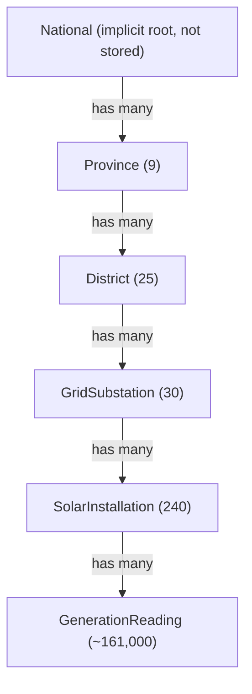
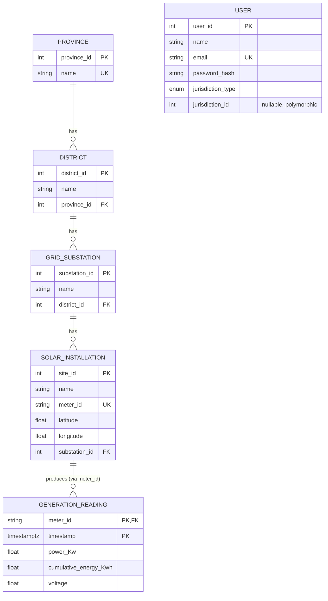
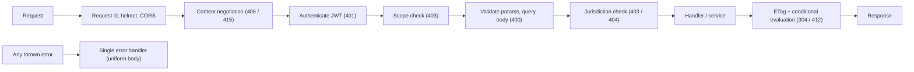
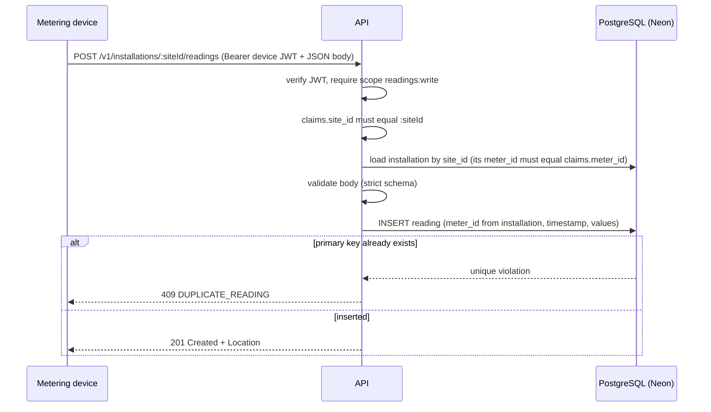
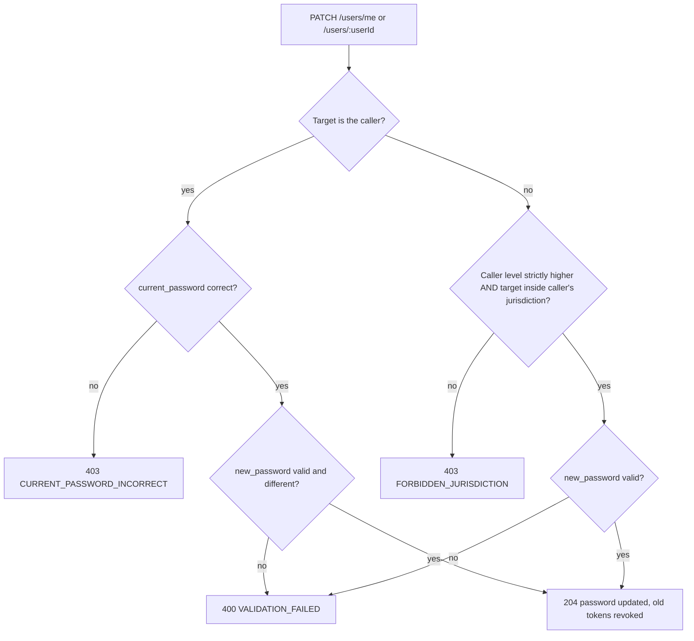
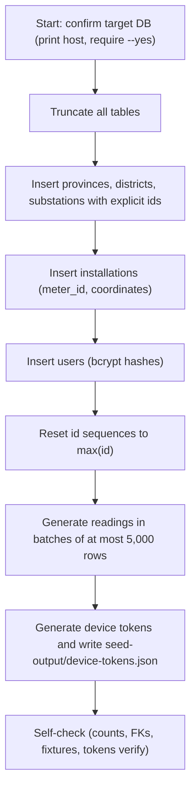
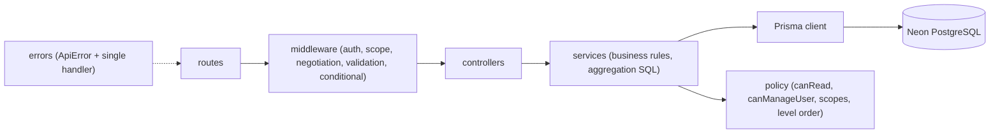

# SLSEA Real-Time Solar Generation Data API: Project Blueprint

> **What this document is.** The single source of truth for what is being built: the domain model, the API contract, the security model, the seed data, the stack and the delivery increments. Implementation tasks are derived from it in a separate `implementation_plan.md`.
>
> **Precedence.** If the module's *REST API Design Guidelines* white paper is available, it overrides any conflicting detail here. Keywords `MUST` and `SHOULD` carry their usual meaning.

---

## 1. Project Overview

### 1.1 Context

The Sri Lanka Sustainable Energy Authority (SLSEA), under the Ministry of Energy, is building a national system to acquire and serve real-time and historical power-generation data from rooftop solar installations across Sri Lanka. Each installation has a smart meter or inverter that **pushes** readings automatically at a fixed interval (15 minutes). SLSEA staff **read** that data, scoped by their jurisdiction (national, provincial or district), to feed operational and analytical dashboards.

There are two entirely separate kinds of client, and the API MUST enforce the difference:

| Client | Authenticates as | May | May not |
|---|---|---|---|
| **Metering device** | one specific installation (device JWT) | write generation readings for that installation | read anything; write anything else; touch any other installation |
| **SLSEA user** | a person (user JWT) | read data within their jurisdiction; change their own password; reset the password of users in a lower level of their jurisdiction | write generation readings; modify the hierarchy or installations |

### 1.2 Goal

Build a REST API at **Richardson Maturity Level 2** (hypermedia is out of scope) with JSON as the only representation, backed by PostgreSQL on **Neon** through **Prisma**, deployable to **Vercel**, with a live OpenAPI (Swagger) surface.

The API is an **acquisition and serving system**: the hierarchy and the installations are seeded reference data exposed read-only; the only data written by the running system is device readings, and the only data changed is user passwords.

### 1.3 Deliverables the implementation must produce

- The API codebase (Node.js, Express, Prisma) in a Git repository with incremental history.
- `openapi.yaml` describing every operation, served as live Swagger UI.
- Prisma schema, migrations, and `seed.js` (plus helper scripts) as specified in §6.
- Automated tests (§9).
- `README.md` (setup, scripts, environment variables, seeding, owner deployment checklist).
- `docs/ai-disclosure.md` maintained per §11.

### 1.4 Handled by the project owner (not by the implementation agent)

Creating the Vercel project, setting its environment variables, running migrations and seeding against Neon, deploying, the written report and the viva. The codebase MUST be Vercel-ready (§10) and the README MUST give the owner exact steps.

### 1.5 Scope

**In scope:** hierarchy read path · installation composite · last-known-reading (derived) · readings history with pagination, filtering, sorting and conditional GET · regional generation summaries (operational) and generation trends (analytical) · device ingestion · account and password management (self-change and higher-jurisdiction reset) · consistent error contract · JWT authentication with scopes and jurisdiction enforcement · seed data · tests.

**Stretch (implement it):** generation summary as a processing resource (the brief's district summary, generalised to every region level) and its analytical companion, generation trend.

**Non-goals:** dashboards/BI/clients · hypermedia · a full OAuth authorization server · refresh tokens · creating, updating or deleting provinces, districts, substations or installations through the API (they are seeded) · user creation/deletion endpoints (users are seeded) · batch ingestion · device-token revocation · multi-region/high availability. **`PUT` is not used anywhere in the API.**

---

## 2. Domain Model

### 2.1 Hierarchy

Sri Lanka (national level) has 9 provinces; a province has districts; a district has grid substations; a grid substation has solar installations; a solar installation has generation readings. "National" is the implicit root and is **not** stored as an entity.



### 2.2 Entity-relationship diagram



`USER` is deliberately outside the hierarchy: it points into it through `jurisdiction_type` + `jurisdiction_id` (a polymorphic reference with no database foreign key; see §2.5).

### 2.3 Entities

**Province**

| Field | Type | Constraints |
|---|---|---|
| `province_id` | integer | PK, auto-increment |
| `name` | string | required, unique |

**District**

| Field | Type | Constraints |
|---|---|---|
| `district_id` | integer | PK, auto-increment |
| `name` | string | required, unique within its province |
| `province_id` | integer | FK → Province, required |

**GridSubstation**

| Field | Type | Constraints |
|---|---|---|
| `substation_id` | integer | PK, auto-increment |
| `name` | string | required, unique within its district |
| `district_id` | integer | FK → District, required |

**SolarInstallation** (the asset)

| Field | Type | Constraints |
|---|---|---|
| `site_id` | integer | PK, auto-increment. The installation's identifier in URIs and in the device token. |
| `name` | string | required |
| `meter_id` | string | required, **unique**. The meter/inverter identifier. It is an attribute of the installation; there is no separate Device entity. |
| `latitude` | number | required, -90..90 |
| `longitude` | number | required, -180..180 |
| `substation_id` | integer | FK → GridSubstation, required |

**GenerationReading** (append-only time series)

| Field | Type | Constraints |
|---|---|---|
| `meter_id` | string | FK → `SolarInstallation.meter_id`; part of the primary key |
| `timestamp` | timestamptz (UTC) | measurement time reported by the device; part of the primary key |
| `power_Kw` | number | instantaneous power, ≥ 0 |
| `cumulative_energy_Kwh` | number | lifetime cumulative energy counter, ≥ 0 |
| `voltage` | number | volts, > 0 |

The reading's identity is the composite `(meter_id, timestamp)`; there is no surrogate id. This makes duplicate readings impossible at the database level. History is a true time series, never "last value" fields on the installation.

**User**

| Field | Type | Constraints |
|---|---|---|
| `user_id` | integer | PK, auto-increment |
| `name` | string | required |
| `email` | string | required, unique, stored lowercased |
| `password_hash` | string | bcrypt hash; never serialised |
| `jurisdiction_type` | enum `national`, `provincial`, `district` | required |
| `jurisdiction_id` | integer, nullable | `national` → `NULL`; `provincial` → a `province_id`; `district` → a `district_id` |

### 2.4 Prisma models

The connection/generator configuration depends on the pinned Prisma major version; follow that version's official documentation for the datasource, driver adapter and client generator (newer majors configure connection URLs in `prisma.config.ts` and use driver adapters; Neon provides a pooled URL for runtime and a direct URL for migrations). The models are:

```prisma
enum JurisdictionType {
  national
  provincial
  district
}

model Province {
  province_id Int        @id @default(autoincrement())
  name        String     @unique
  districts   District[]

  @@map("provinces")
}

model District {
  district_id Int              @id @default(autoincrement())
  name        String
  province_id Int
  province    Province         @relation(fields: [province_id], references: [province_id])
  substations GridSubstation[]

  @@unique([province_id, name])
  @@index([province_id])
  @@map("districts")
}

model GridSubstation {
  substation_id Int                 @id @default(autoincrement())
  name          String
  district_id   Int
  district      District            @relation(fields: [district_id], references: [district_id])
  installations SolarInstallation[]

  @@unique([district_id, name])
  @@index([district_id])
  @@map("grid_substations")
}

model SolarInstallation {
  site_id       Int                 @id @default(autoincrement())
  name          String
  meter_id      String              @unique
  latitude      Float
  longitude     Float
  substation_id Int
  substation    GridSubstation      @relation(fields: [substation_id], references: [substation_id])
  readings      GenerationReading[]

  @@index([substation_id])
  @@map("solar_installations")
}

model GenerationReading {
  meter_id              String
  timestamp             DateTime          @db.Timestamptz(3)
  power_Kw              Float             @map("power_kw")
  cumulative_energy_Kwh Float             @map("cumulative_energy_kwh")
  voltage               Float
  installation          SolarInstallation @relation(fields: [meter_id], references: [meter_id], onDelete: Restrict)

  @@id([meter_id, timestamp])
  @@index([timestamp])
  @@map("generation_readings")
}

model User {
  user_id           Int              @id @default(autoincrement())
  name              String
  email             String           @unique
  password_hash     String
  jurisdiction_type JurisdictionType
  jurisdiction_id   Int?

  @@map("users")
}
```

Columns are lower-case in the database (via `@map`), so raw SQL needs no identifier quoting. The API's JSON uses the model field names (`power_Kw`, `cumulative_energy_Kwh`).

### 2.5 Database constraints and indexes

Add a hand-written SQL migration (`prisma migrate dev --create-only`, then edit) for rules Prisma cannot express:

```sql
ALTER TABLE users ADD CONSTRAINT users_jurisdiction_chk CHECK (
  (jurisdiction_type = 'national' AND jurisdiction_id IS NULL) OR
  (jurisdiction_type <> 'national' AND jurisdiction_id IS NOT NULL)
);
ALTER TABLE generation_readings ADD CONSTRAINT readings_values_chk CHECK (
  power_kw >= 0 AND cumulative_energy_kwh >= 0 AND voltage > 0
);
```

| Table | Index / constraint | Serves |
|---|---|---|
| provinces | unique `name` | uniqueness |
| districts | unique `(province_id, name)`; index `province_id` | scoped list |
| grid_substations | unique `(district_id, name)`; index `district_id` | scoped list |
| solar_installations | unique `meter_id`; index `substation_id` | lookup by meter, scoped list |
| generation_readings | **PK `(meter_id, timestamp)`**; index `timestamp` | history, last-known (backward index scan), duplicate rejection, time-window scans |
| users | unique `email` | login |

`users.jurisdiction_id` is a polymorphic reference with no foreign key. The seed script MUST verify that it points to an existing province (for `provincial`) or district (for `district`); the user-management service uses the same check whenever it resolves a user's jurisdiction.

### 2.6 Invariants

1. `(meter_id, timestamp)` is unique; a duplicate reading is rejected (409).
2. Readings are never updated or deleted through the API (405).
3. A reading's `meter_id` always comes from the authenticated device's installation, never from the request body.
4. Provinces, districts, substations and installations are read-only through the API (seeded reference data).
5. `password_hash` is never present in any response, log or token.

---

## 3. Resource Taxonomy & URI Design

URIs are lowercase, hyphenated, plural for collections, nouns only (no verbs). Atomic resources have a short canonical URI; lists are **scoped under their parent** wherever a list only makes sense under it. Base path: `/v1`. Path parameters: `provinceId`, `districtId`, `substationId`, `siteId`, `userId` (integers; `userId` may also be the literal `me`) and `timestamp` (ISO-8601 UTC).

### 3.1 Resource table

| Taxonomy | URI | Methods | Notes |
|---|---|---|---|
| Collection | `/provinces` | GET | |
| Atomic | `/provinces/{provinceId}` | GET | |
| Collection (scoped) | `/provinces/{provinceId}/districts` | GET | |
| Atomic | `/districts/{districtId}` | GET | |
| Collection (scoped) | `/districts/{districtId}/grid-substations` | GET | |
| Atomic | `/grid-substations/{substationId}` | GET | |
| Collection (scoped) | `/grid-substations/{substationId}/installations` | GET | same options as `/installations` (`reporting`, `include`) |
| Collection | `/installations` | GET | filters `province_id`, `district_id`, `substation_id`, `reporting`; option `include=last_known_reading` |
| Atomic | `/installations/{siteId}` | GET | |
| **Composite** | `/installations/{siteId}/overview` | GET | installation + hierarchy path + last-known reading + today's totals |
| **Derived** | `/installations/{siteId}/last-known-reading` | GET | operational real-time view |
| Collection (scoped) | `/installations/{siteId}/readings` | GET, **POST** | analytical history; device ingestion |
| Atomic | `/installations/{siteId}/readings/{timestamp}` | GET | target of the `Location` header after POST |
| Collection (query) | `/readings` | GET | cross-installation history filtered by jurisdiction and time |
| **Processing** (operational) | `/generation-summary` | GET | the caller's whole jurisdiction (a national user gets the whole country) |
| **Processing** (operational) | `/provinces/{provinceId}/generation-summary` | GET | |
| **Processing** (operational) | `/districts/{districtId}/generation-summary` | GET | the brief's district summary |
| **Processing** (operational) | `/grid-substations/{substationId}/generation-summary` | GET | |
| **Processing** (analytical) | `/generation-trend` | GET | time-bucketed energy for the caller's whole jurisdiction |
| **Processing** (analytical) | `/provinces/{provinceId}/generation-trend` | GET | |
| **Processing** (analytical) | `/districts/{districtId}/generation-trend` | GET | |
| **Processing** (analytical) | `/grid-substations/{substationId}/generation-trend` | GET | |
| **Processing** (analytical) | `/installations/{siteId}/generation-trend` | GET | daily/hourly energy of one installation |
| Auth | `/auth/tokens` | POST | user login → JWT |
| Collection | `/users` | GET | users the caller is allowed to reset (§5.5) |
| Atomic | `/users/me` | GET, **PATCH** | PATCH = change **own** password (requires `current_password`) |
| Atomic | `/users/{userId}` | GET, **PATCH** | PATCH = **reset** another user's password as a higher-jurisdiction user (no `current_password`) |
| Ops | `/health` | GET | public, unversioned |
| Docs | `/docs`, `/openapi.json` | GET | public, unversioned |

`/users/me` MUST be routed before `/users/{userId}`.

Unsupported methods on a known URI return `405` with an `Allow` header (e.g. `PUT` anywhere, `DELETE` anywhere, `PATCH /installations/1`, `POST /provinces`, `DELETE /installations/1/readings/…`).

### 3.2 Representations

| Resource | Fields |
|---|---|
| Province | `province_id`, `name` |
| District | `district_id`, `name`, `province_id` |
| GridSubstation | `substation_id`, `name`, `district_id` |
| SolarInstallation | `site_id`, `name`, `meter_id`, `latitude`, `longitude`, `substation_id` |
| GenerationReading | `site_id` (derived by join, not stored), `meter_id`, `timestamp`, `power_Kw`, `cumulative_energy_Kwh`, `voltage` |
| User | `user_id`, `name`, `email`, `jurisdiction_type`, `jurisdiction_id` |

Derived fields keep the model's unit casing (`total_power_Kw`, `energy_today_Kwh`).

### 3.3 Composite: `/installations/{siteId}/overview`

One response carrying: the installation fields; `substation`, `district`, `province` (id + name each); `last_known_reading` (same shape as §3.4, or `null` if none); `today` (`energy_Kwh`, `peak_power_Kw`, `reading_count`, for the current Asia/Colombo day).

### 3.4 Derived: `/installations/{siteId}/last-known-reading`

The single most recent reading for the installation, computed on request (`ORDER BY timestamp DESC LIMIT 1` on the primary-key index). It is **not** stored on the installation. Adds derived fields `age_seconds` and `is_stale` (`age > STALE_AFTER_MINUTES`, default 30, i.e. two missed intervals). `404` if the installation exists but has no readings yet.

### 3.5 Processing (operational): generation summary

URIs: `/generation-summary`, `/provinces/{provinceId}/generation-summary`, `/districts/{districtId}/generation-summary`, `/grid-substations/{substationId}/generation-summary`. One handler, parameterised by region. The root form takes no region from the URI and resolves to the caller's own jurisdiction: national user → whole country, provincial user → their province, district user → their district.

Aggregate over every installation in the region:

| Field | Definition |
|---|---|
| `scope` | `{ "type": "national" \| "province" \| "district" \| "substation", "id": <id or null for national>, "name": <name, "Sri Lanka" for national> }` |
| `installations_total` | installations in the region |
| `installations_reporting` | installations whose latest reading is within `STALE_AFTER_MINUTES` of `as_of` |
| `installations_not_reporting` | `total - reporting` (stale or never reported) |
| `total_power_Kw` | sum of `power_Kw` of the latest reading of each *reporting* installation |
| `energy_today_Kwh` | per installation: (latest `cumulative_energy_Kwh` today) − (`cumulative_energy_Kwh` of the last reading before 00:00 Asia/Colombo, or of the first reading today if none earlier); summed; installations with no reading today contribute 0 |
| `as_of`, `timezone` | UTC computation time; `"Asia/Colombo"` |

Implement with one `$queryRaw` per request using `DISTINCT ON (meter_id) … ORDER BY meter_id, timestamp DESC` restricted to the last 48 hours, with the region expressed as a predicate over installations → substations → districts → provinces. Parameterised tagged templates only. `COUNT`/`SUM` results can come back as `bigint`/`numeric`; convert to JSON numbers. A region with zero installations returns zeros, not 404. "Today" is computed from a fixed UTC+05:30 offset (Sri Lanka has no DST) and converted to UTC for querying.

### 3.6 Processing (analytical): generation trend

URIs: `/generation-trend` (caller's whole jurisdiction, same resolution as §3.5), `/provinces/{provinceId}/generation-trend`, `/districts/{districtId}/generation-trend`, `/grid-substations/{substationId}/generation-trend`, `/installations/{siteId}/generation-trend`. One handler, parameterised by region. It answers "how has generation behaved over time, by region" without the client downloading raw readings.

**Query parameters:** `from` and `to` (both required, ISO-8601), `interval` (`hour` or `day`, default `day`), `page`, `page_size`, `sort` (`bucket_start` or `-bucket_start`, default `bucket_start`).

**Bucket rules**

- Buckets are aligned to Asia/Colombo local time (local hour, or local midnight-to-midnight day). `bucket_start`/`bucket_end` are UTC ISO strings.
- `from` is floored and `to` is ceiled to bucket boundaries; the response echoes the result as `effective_from`/`effective_to`.
- Maximum span: `hour` ≤ 7 days, `day` ≤ 92 days (longer → `400 INVALID_QUERY`). Invalid `interval` or missing `from`/`to` → `400`.
- **Every bucket in the range is present** (zero-filled) so series are continuous for charts.

**Bucket fields**

| Field | Definition |
|---|---|
| `bucket_start`, `bucket_end` | UTC ISO timestamps of the local bucket |
| `energy_Kwh` | sum over the region's installations of the **positive deltas** of `cumulative_energy_Kwh` between consecutive readings of the same installation, attributed to the bucket containing the later reading. The first reading in range uses the latest reading up to 1 hour before `effective_from` as its predecessor, if any, else contributes 0. A negative delta (counter reset) counts as 0. For `interval=hour`, `energy_Kwh` also equals the average regional power in kW over that hour. |
| `reporting_installations` | distinct installations with at least one reading in the bucket |
| `reading_count` | number of readings in the bucket |

**Response:** the standard collection envelope (§4.4) plus a top-level `meta` object: `{ "scope": {…as in §3.5…}, "interval", "timezone", "effective_from", "effective_to" }`.

**Implementation:** one SQL query per request: a `LAG(cumulative_energy_kwh) OVER (PARTITION BY meter_id ORDER BY timestamp)` over `[effective_from - 1 hour, effective_to)`, then group by local bucket (`date_trunc` on `timezone('Asia/Colombo', timestamp)`). Build the full bucket list in application code (fixed UTC+05:30 offset), merge the query result into it to zero-fill, then paginate the merged list in memory (it is at most 168 or 92 items). `interval` is validated against a whitelist before it reaches SQL.

---

## 4. HTTP Contract

### 4.1 Request pipeline



A `304` or `412` MUST never be sent to a caller who failed authentication or authorization. Conditional evaluation happens last.

### 4.2 Status codes

| Situation | Status |
|---|---|
| Successful GET / token issue | `200` |
| Conditional GET and the client copy is current | `304`, empty body, `ETag` retained |
| Successful create (reading) | `201` + `Location` + body |
| Successful password change or reset (PATCH) | `204` |
| Malformed JSON, validation failure, bad query parameter, bad path id | `400` |
| Missing, invalid, expired or revoked token | `401` + `WWW-Authenticate: Bearer` |
| Valid token but missing scope, outside jurisdiction, wrong installation, wrong current password, not allowed to reset that user | `403` |
| Unknown id, unknown route | `404` |
| Method not supported on the URI | `405` + `Allow` |
| `Accept` cannot be satisfied (only `application/json` is offered) | `406` |
| `If-Match` supplied on a GET and it does not match the current ETag | `412` |
| Wrong `Content-Type` on a write | `415` |
| Duplicate reading `(meter_id, timestamp)` | `409` |
| Rate limit exceeded | `429` |
| Unhandled server fault | `500` (generic message, no stack trace) |

### 4.3 Headers

| Header | Where |
|---|---|
| `Content-Type: application/json; charset=utf-8` | every body response |
| `Location` (absolute URI) | every `201` |
| `ETag` | every successful GET (hash of the serialised body) |
| `Last-Modified` | only where a source timestamp exists: a reading (its `timestamp`), the last-known-reading, a reading collection page (newest `timestamp` in the page), generation summary (`as_of`). Not emitted for hierarchy resources, installations or users (no modification timestamp is stored). |
| `Cache-Control: private, no-cache` | authenticated GETs (forces revalidation so `304` is meaningful) |
| `Vary: Accept, Authorization` | all GETs |
| `Link` (RFC 8288: `first`, `prev`, `next`, `last`) | paginated collections |
| `Allow` | `405` |
| `WWW-Authenticate: Bearer` | `401` |
| `X-Request-Id` | every response |
| `If-None-Match`, `If-Modified-Since` | honoured on GET → `304` (`If-Modified-Since` only where `Last-Modified` exists) |
| `If-Match` | honoured on GET: if none of the supplied ETags matches the current representation → `412` (RFC 9110 semantics); optional for clients |

Content negotiation: accept `application/json`, `application/*`, `*/*`; otherwise `406`. Writes (`POST`, `PATCH`) require `Content-Type: application/json`; otherwise `415`.

Absolute URLs (in `Location` and pagination links) are built from the forwarded protocol/host (`trust proxy` enabled).

### 4.4 Representation conventions

- JSON only; field names exactly as in §2.3; timestamps are ISO-8601 UTC strings (`2026-10-09T05:15:00.000Z`); numbers are JSON numbers; identifiers are integers.
- A single resource is returned as the bare object (no wrapper).
- Every collection uses this envelope (the only links in the API are pagination links; no other hypermedia):

```json
{
  "data": [],
  "pagination": { "page": 2, "page_size": 50, "total_count": 672, "total_pages": 14 },
  "links": { "self": "…", "first": "…", "prev": "…", "next": "…", "last": "…" }
}
```

`prev` is `null` on page 1 and `next` is `null` on the last page. A page beyond the last returns `200` with empty `data` and correct counts. Total count and page data are read in one transaction. Generation-trend collections additionally carry a top-level `meta` object (§3.6).

### 4.5 Pagination, filtering, sorting

| Concern | Rule |
|---|---|
| Pagination | `page` (≥ 1, default 1), `page_size` (1..`MAX_PAGE_SIZE`=500, default 50). Offset-based. Applies to **every** collection. |
| Time window | `from` (inclusive), `to` (exclusive), ISO-8601 with offset or `Z`; `from < to`. On `/installations/{siteId}/readings` both optional (no default). On `/readings` defaults are `to = now`, `from = to - 24h`, and the span MUST NOT exceed 31 days. |
| Jurisdiction filter | `/readings` and `/installations` accept `province_id`, `district_id`, `substation_id`. `/readings` also accepts `site_id`. Multiple filters are AND-ed (contradictory filters yield an empty set). |
| Operational list options | `/installations` and `/grid-substations/{substationId}/installations` accept `reporting` (`true`: latest reading within `STALE_AFTER_MINUTES`; `false`: stale or never reported) and `include=last_known_reading` (each item gains a `last_known_reading` object in the §3.4 shape without ids, or `null`). Both are computed in the database, never by per-item requests. |
| Aggregation (trend) | `generation-trend` resources require `from` and `to` and accept `interval`, `page`, `page_size` and `sort` (`bucket_start`, `-bucket_start`). Bucket rules and limits are in §3.6. |
| Scope interplay | Filters only **narrow**. Results are always intersected with the caller's jurisdiction. A filter naming something outside the caller's jurisdiction → `403`. With no filter, the caller's whole jurisdiction is implied. |
| Sorting | `sort=timestamp` (ascending) or `sort=-timestamp` (descending) on readings; default `-timestamp`. Other collections accept `sort=name` / `sort=-name`; default is primary key ascending. An unknown sort field → `400`. |
| Strictness | Unknown query parameters → `400`, so typos are caught. |

### 4.6 Write semantics

The running API has exactly two kinds of write. Everything else is read-only; `PUT` and `DELETE` do not exist anywhere.

**1. Device ingestion.** `POST /v1/installations/{siteId}/readings`, `Authorization: Bearer <device token>`:

```json
{ "timestamp": "2026-10-09T05:15:00Z", "power_Kw": 2.31, "cumulative_energy_Kwh": 18234.52, "voltage": 231.4 }
```



Rules: strict schema (any other field, including `meter_id`, `site_id`, is rejected with `400`); `timestamp` accepted with any offset and stored as UTC, not more than 5 minutes in the future and not older than 30 days; `0 ≤ power_Kw ≤ MAX_POWER_KW` (default 50); `cumulative_energy_Kwh ≥ 0`; `150 ≤ voltage ≤ 300`; the token's `site_id` must equal the path `siteId` (else `403 FORBIDDEN_INSTALLATION`) and the installation's stored `meter_id` must equal the token's `meter_id`. Duplicate `(meter_id, timestamp)` → `409` (so a device retry never double-inserts). Success: `201`, `Location: https://<host>/v1/installations/{siteId}/readings/{timestamp}` (timestamp in canonical UTC ISO form, URL-encoded), body = the created reading. *Optional extra validation:* reject a `cumulative_energy_Kwh` lower than the nearest earlier reading.

**2. Password changes** (full rules in §5.5):

| Request | Body | Effect |
|---|---|---|
| `PATCH /v1/users/me` | `{ "current_password", "new_password" }` | the caller changes their own password; `204` |
| `PATCH /v1/users/{userId}` | `{ "new_password" }` | a higher-jurisdiction user resets another user's password; `204` |

Both use PATCH because only one attribute of the user changes (a partial update; PUT would imply replacing the whole user). The body is strict: unknown fields → `400`.

### 4.7 Error contract

Every 4xx/5xx, including unknown routes, malformed JSON, auth failures, 405, 406, 415 and 429, passes through **one** error handler and returns this body:

```json
{
  "error": {
    "code": "VALIDATION_FAILED",
    "message": "Request validation failed.",
    "status": 400,
    "details": [ { "field": "power_Kw", "issue": "must be >= 0" } ],
    "request_id": "b6f1c0a2-0f5e-4d3a-9d6c-1d2a3b4c5d6e"
  }
}
```

`details` is always an array (possibly empty).

| `code` | Status |
|---|---|
| `VALIDATION_FAILED`, `MALFORMED_JSON`, `INVALID_QUERY` | 400 |
| `UNAUTHENTICATED`, `TOKEN_EXPIRED`, `TOKEN_REVOKED` | 401 |
| `FORBIDDEN_SCOPE`, `FORBIDDEN_JURISDICTION`, `FORBIDDEN_INSTALLATION`, `CURRENT_PASSWORD_INCORRECT` | 403 |
| `NOT_FOUND` | 404 |
| `METHOD_NOT_ALLOWED` | 405 |
| `NOT_ACCEPTABLE` | 406 |
| `DUPLICATE_READING` | 409 |
| `PRECONDITION_FAILED` | 412 |
| `UNSUPPORTED_MEDIA_TYPE` | 415 |
| `RATE_LIMITED` | 429 |
| `INTERNAL_ERROR` | 500 |

---

## 5. Security Model

### 5.1 Principals and tokens

| Principal | Obtains token | Token claims |
|---|---|---|
| **Device** (one installation) | Pre-provisioned long-lived JWT. Generated by `seed.js` for every seeded installation (§6.7) and regenerable with `npm run seed:tokens`. Devices never log in. | `typ="device"`, `sub=<site_id>`, `site_id`, `meter_id`, `scope="readings:write"`, `iss`, `aud`, `iat`, `exp` (`DEVICE_TOKEN_TTL_DAYS`, default 365) |
| **SLSEA user** | `POST /auth/tokens` with `{"email","password"}` → `200 {"access_token","token_type":"Bearer","expires_in","scope"}` | `typ="user"`, `sub=<user_id>`, `jurisdiction_type`, `jurisdiction_id` (null for national), `scope`, `pv`, `iss`, `aud`, `iat`, `exp` (`USER_TOKEN_TTL_SECONDS`, default 3600) |

Login failure returns the same `401` whether the email is unknown or the password is wrong (no account enumeration).

### 5.2 Scopes

| Scope | Granted to | Allows |
|---|---|---|
| `readings:write` | devices only | `POST /installations/{own siteId}/readings` |
| `generation:read` | every user | all GET endpoints on the hierarchy, installations, readings, summaries |
| `account:manage` | every user | `/users` endpoints (§5.5): own profile and password, and the reset rights derived from jurisdiction |

Scopes are assigned at login. **The write/read split is enforced by scope:** a device token has neither `generation:read` nor `account:manage`, so every GET and every `/users` call returns `403`; a user token has no `readings:write`, so ingestion returns `403` for every user including national. Whether a given user may reset a given other user is an **attribute** decision (§5.5), not a scope.

### 5.3 Jurisdiction enforcement

One pure function, `canRead(principal, target)`, used by **every** data-read handler and exhaustively unit-tested. Ownership is resolved through the hierarchy chain (reading → installation → substation → district → province).

| Caller | May read |
|---|---|
| `national` | everything |
| `provincial` (`jurisdiction_id` = province) | that province and every district, substation, installation and reading beneath it |
| `district` (`jurisdiction_id` = district) | that district and everything beneath it, plus (metadata only) its parent province for navigation |

- **Lists are filtered**, not rejected: e.g. for a district user `GET /provinces` returns only their parent province, and `GET /provinces/{id}/districts` returns only their district.
- **Directly addressing** something outside the caller's jurisdiction → `403 FORBIDDEN_JURISDICTION`; an id that does not exist → `404`.
- Jurisdiction always comes from verified token claims, never from query parameters or bodies. Filters (§4.5) can only narrow.
- The root forms `/generation-summary` and `/generation-trend` take no region from the URI: they resolve to the caller's own jurisdiction (national → whole country, provincial → their province, district → their district). Regional forms are checked with `canRead` like any other resource.

### 5.4 Token verification rules

- HS256 with `JWT_SECRET` (≥ 32 random bytes). Allowed algorithms are **pinned** (reject `none` and anything else). Validate `iss`, `aud`, `exp`.
- **Device tokens:** after verification, `typ` MUST be `device` and scope `readings:write`; then apply the §4.6 checks (`site_id` equals path, stored `meter_id` equals claim).
- **User tokens (revocation without extra columns):** the `pv` claim is the first 16 hex characters of `SHA-256(password_hash)` at the time of issue. On every user-token request, load the user by `user_id` (primary-key lookup) and compare: if the user no longer exists or `pv` differs → `401 TOKEN_REVOKED`. Therefore any password change or reset immediately invalidates all of that user's existing tokens.
- A user token must never be accepted where a device token is required, and vice versa.

### 5.5 Account and password management

Users cannot be created or deleted through the API (they are seeded). The `/users` endpoints exist so users can change their own password, and so a higher-jurisdiction user can reset the password of someone who has forgotten it.

**Level order:** `national` > `provincial` > `district`.

**Manageable users.** A caller may *manage* (reset) a target user when the caller's level is **strictly higher** than the target's **and** the target's jurisdiction lies within the caller's:

| Caller | May reset |
|---|---|
| national | every provincial and district user (not other national users) |
| provincial | district users whose district belongs to the caller's province |
| district | nobody |

Users at the same level (including two national users) cannot reset each other.

**Endpoints**

| Endpoint | Behaviour |
|---|---|
| `GET /v1/users` | Paginated list of the users the caller may manage (empty for district users). Same envelope, `sort=name`, ETag. The caller's own record is **not** included (use `/users/me`). |
| `GET /v1/users/me` | The caller's own profile (§3.2). |
| `GET /v1/users/{userId}` | Profile of that user if it is the caller or a manageable user; otherwise `403 FORBIDDEN_JURISDICTION`; unknown id → `404`. |
| `PATCH /v1/users/me` | **Self-change.** Body `{ "current_password", "new_password" }`, both required. `current_password` must match the stored hash, otherwise `403 CURRENT_PASSWORD_INCORRECT`. The new password must differ from the current one. `204`. |
| `PATCH /v1/users/{userId}` | **Reset by a higher jurisdiction.** Body `{ "new_password" }` only (a supplied `current_password` → `400`). Allowed only for a manageable user; otherwise `403 FORBIDDEN_JURISDICTION`; unknown id → `404`. If `userId` equals the caller's own id, the request is treated exactly as `PATCH /users/me`. `204`. |

All `/users` endpoints require a user token with scope `account:manage`.



**Password policy:** at least 10 characters, containing at least one letter and one digit; violations return `400 VALIDATION_FAILED` with `details`. Hash with bcrypt (cost ≥ 10). Success invalidates every existing token of the affected user (§5.4). Both PATCH endpoints are subject to a strict rate limit, and responses never reveal whether a password was "close".

### 5.6 Hardening checklist

- `helmet`; HTTPS is provided by Vercel (send HSTS); CORS restricted to `CORS_ORIGINS`.
- Rate-limit `/auth/tokens` and the password PATCH endpoints tightly, and the whole API loosely. (In serverless the limiter is per-instance, best effort.)
- Request body size limit (10 kb); strict Zod schemas on every body, query and path parameter.
- Prisma parameterises queries; any `$queryRaw` MUST use tagged-template parameters, never string concatenation.
- Logs never contain tokens, passwords, hashes or `JWT_SECRET`. Secrets only via environment variables; `.env` and `seed-output/` are git-ignored; `.env.example` is committed.
- Serialisers whitelist fields; `password_hash` is never selected into a response path.

---

## 6. Seed Data

`prisma/seed.js` MUST produce the dataset below, deterministically, so every endpoint returns real data and tests can rely on fixed identifiers. This section is the contract for the seed.

### 6.1 Targets

| Element | Count |
|---|---|
| Provinces | 9 |
| Districts | 25 |
| Grid substations | 30 |
| Solar installations | 240 |
| Generation readings | 7 days × 96 per day = 672 per installation → **~161,000** (two fixture installations differ, see §6.5) |
| Users | 7 |

### 6.2 Seeding pipeline



Insert with **explicit ids** as given below, then advance every sequence (`setval(pg_get_serial_sequence(...), max(id))`) so any later inserts do not collide. Use `createMany` in batches of at most 5,000 rows (stay under PostgreSQL's bind-parameter limit and keep Neon round trips low). The script is destructive: it MUST print the database host and require `--yes` (or `SEED_CONFIRM=yes`) before truncating.

### 6.3 Geography: provinces, districts, substations, installations

Ids are assigned in this exact order (provinces, then districts, then substations, then installations), so identifiers are stable.

| province_id | Province | district_id | District | Centre latitude | Centre longitude | Substations (substation_id) | Installations | site_id range |
|---|---|---|---|---|---|---|---|---|
| 1 | Western | 1 | Colombo | 6.9271 | 79.8612 | 3 (1-3) | 32 | 1-32 |
| 1 | Western | 2 | Gampaha | 7.0873 | 79.9925 | 2 (4-5) | 24 | 33-56 |
| 1 | Western | 3 | Kalutara | 6.5854 | 79.9607 | 1 (6) | 12 | 57-68 |
| 2 | Central | 4 | Kandy | 7.2906 | 80.6337 | 2 (7-8) | 20 | 69-88 |
| 2 | Central | 5 | Matale | 7.4675 | 80.6234 | 1 (9) | 7 | 89-95 |
| 2 | Central | 6 | Nuwara Eliya | 6.9497 | 80.7891 | 1 (10) | 6 | 96-101 |
| 3 | Southern | 7 | Galle | 6.0535 | 80.2210 | 1 (11) | 14 | 102-115 |
| 3 | Southern | 8 | Matara | 5.9549 | 80.5550 | 1 (12) | 10 | 116-125 |
| 3 | Southern | 9 | Hambantota | 6.1241 | 81.1185 | 1 (13) | 8 | 126-133 |
| 4 | Northern | 10 | Jaffna | 9.6615 | 80.0255 | 1 (14) | 9 | 134-142 |
| 4 | Northern | 11 | Kilinochchi | 9.3803 | 80.3770 | 1 (15) | 4 | 143-146 |
| 4 | Northern | 12 | Mannar | 8.9810 | 79.9044 | 1 (16) | 3 | 147-149 |
| 4 | Northern | 13 | Vavuniya | 8.7514 | 80.4971 | 1 (17) | 4 | 150-153 |
| 4 | Northern | 14 | Mullaitivu | 9.2671 | 80.8142 | 1 (18) | 3 | 154-156 |
| 5 | Eastern | 15 | Batticaloa | 7.7102 | 81.6924 | 1 (19) | 7 | 157-163 |
| 5 | Eastern | 16 | Ampara | 7.2975 | 81.6820 | 1 (20) | 8 | 164-171 |
| 5 | Eastern | 17 | Trincomalee | 8.5874 | 81.2152 | 1 (21) | 6 | 172-177 |
| 6 | North Western | 18 | Kurunegala | 7.4863 | 80.3647 | 2 (22-23) | 15 | 178-192 |
| 6 | North Western | 19 | Puttalam | 8.0362 | 79.8283 | 1 (24) | 8 | 193-200 |
| 7 | North Central | 20 | Anuradhapura | 8.3114 | 80.4037 | 1 (25) | 9 | 201-209 |
| 7 | North Central | 21 | Polonnaruwa | 7.9403 | 81.0188 | 1 (26) | 5 | 210-214 |
| 8 | Uva | 22 | Badulla | 6.9934 | 81.0550 | 1 (27) | 7 | 215-221 |
| 8 | Uva | 23 | Monaragala | 6.8728 | 81.3507 | 1 (28) | 5 | 222-226 |
| 9 | Sabaragamuwa | 24 | Ratnapura | 6.7056 | 80.3847 | 1 (29) | 8 | 227-234 |
| 9 | Sabaragamuwa | 25 | Kegalle | 7.2513 | 80.3464 | 1 (30) | 6 | 235-240 |

Totals: 9 provinces, 25 districts, 30 substations, 240 installations.

**Naming and field rules**

- Substation `name`: `"{District} Grid Substation {n}"`, with `n` counting from 1 within the district (e.g. `Colombo Grid Substation 2`).
- Installation `name`: `"{District} Rooftop Solar {k}"`, with `k` counting from 1 within the district. `meter_id`: `MTR-` + `site_id` zero-padded to 4 digits (`MTR-0001` … `MTR-0240`).
- Installations of a district are spread across its substations round-robin in site order.
- `latitude`/`longitude`: district centre plus a deterministic uniform jitter of ±0.04°, rounded to 5 decimals. (Synthetic data; positions need not be exactly on land.)

### 6.4 Users

All seeded users share one demo password, taken from `SEED_DEMO_PASSWORD` (default `Solar#Demo2026`), stored bcrypt-hashed.

| user_id | name | email | jurisdiction_type | jurisdiction_id | Purpose |
|---|---|---|---|---|---|
| 1 | National Operator | `national.operator@slsea.lk` | national | NULL | reads everything; may reset any provincial or district user |
| 2 | National Analyst | `national.analyst@slsea.lk` | national | NULL | second national user: proves same-level cannot reset |
| 3 | Western Province Officer | `western.province@slsea.lk` | provincial | 1 | province scope; may reset Colombo, Gampaha and Kalutara users |
| 4 | Central Province Officer | `central.province@slsea.lk` | provincial | 2 | cross-province leakage and reset tests |
| 5 | Colombo District Officer | `colombo.district@slsea.lk` | district | 1 | district scope |
| 6 | Gampaha District Officer | `gampaha.district@slsea.lk` | district | 2 | cross-district leakage within one province |
| 7 | Kandy District Officer | `kandy.district@slsea.lk` | district | 4 | cross-province district leakage |

### 6.5 Readings

Each installation gets one reading every 15 minutes for 7 days, ending at the latest 15-minute boundary at or before the seeding time (`end`). Timestamps are `end - 15 min × k` for `k = 0..671`, stored as UTC.

**Deterministic generation.** Use a seeded PRNG (e.g. mulberry32, base seed `SEED_RANDOM`, default `20260601`); per-site randomness derives from `base seed + site_id` so results are reproducible and `seed:extend` can continue any site's series.

| Quantity | Rule |
|---|---|
| Site capacity (seed-time only, **not stored**) | `3 + 12 × rand` kW, derived deterministically from `site_id` (range 3-15 kW) |
| Local solar time | convert timestamp to Asia/Colombo (UTC+05:30) |
| Solar curve | for local hour `h` between 06:00 and 18:00: `sin(π (h − 6) / 12) ^ 1.5`; otherwise 0 (overnight power is exactly 0) |
| Cloud factor | per-site-per-day base in 0.35-1.0, with a smooth intra-day random walk |
| `power_Kw` | `capacity × solar_curve × cloud_factor × (1 ± 5% noise)`, rounded to 3 decimals, never negative |
| `cumulative_energy_Kwh` | starts at `500 + 20000 × rand(site)` before the first reading; each reading adds `power_Kw × 0.25`; monotonically non-decreasing; 3 decimals |
| `voltage` | `230 + N(0, 2.5)`, clamped to 215-245, 1 decimal |

**Fixture installations (for edge-case testing):**

| site_id | Fixture | Behaviour |
|---|---|---|
| 239 | **Offline site** | readings stop 6 hours before `end`; its last reading is therefore stale (`is_stale = true`, counted as not reporting in summaries) |
| 240 | **Empty site** | no readings at all (last-known-reading → 404, empty history, first-ingest tests) |

### 6.6 Extending the data (`npm run seed:extend`)

Run locally against the same database before any demo or marking so "last known" and "today" are fresh. For every installation **except fixtures 239 and 240**, append readings from its latest stored timestamp + 15 min up to the latest 15-minute boundary at or before now, continuing `cumulative_energy_Kwh` from the latest stored value and using the same generator and per-site randomness. It never modifies or deletes existing rows and is safe to run repeatedly.

### 6.7 Device tokens (`seed-output/device-tokens.json`)

`seed.js` MUST write one device JWT per seeded installation (including 239 and 240), signed with `JWT_SECRET`, using the claims in §5.1. `npm run seed:tokens` regenerates the same file from the installations currently in the database without touching any data (use it if the file is lost or `JWT_SECRET` changes). Format:

```json
{
  "generated_at": "2026-10-09T05:20:00.000Z",
  "issuer": "slsea-solar-api",
  "audience": "slsea-solar-api",
  "tokens": [
    { "site_id": 1, "meter_id": "MTR-0001", "token": "eyJhbGciOi…" }
  ]
}
```

The `seed-output/` directory is git-ignored (these are real write credentials for the deployed API). The same file is consumed by `npm run simulate` (§7.5) and by the integration tests.

### 6.8 Self-check (end of `seed.js`)

The script MUST assert and print: row counts match §6.1; every foreign key resolves; every `jurisdiction_id` points at an existing province/district matching its type; each non-fixture installation has exactly 672 readings; site 239's newest reading is 6 hours older than the others'; site 240 has none; every token in the JSON verifies against `JWT_SECRET` and its `site_id`/`meter_id` match the database. Any failure exits non-zero.

### 6.9 Scaled-down variant for tests

The seed module also exposes a `test` scale (Western and Central provinces only, ≤ 40 installations, 2 days of history, same generators and fixture rules) so tests load quickly. Tests MUST look entities up by name rather than hard-coding full-scale ids.

---

## 7. Architecture & Tech Stack

### 7.1 Stack

| Concern | Choice |
|---|---|
| Runtime / framework | Node.js (LTS supported by Vercel), Express, plain JavaScript (CommonJS or ESM, used consistently) |
| Database | PostgreSQL on Neon (pooled connection for runtime, direct connection for migrations) |
| ORM | Prisma (pinned major; follow its docs for datasource/adapter setup) |
| Validation | Zod (params, query, bodies) |
| Auth | `jsonwebtoken`, `bcryptjs` |
| Security | `helmet`, `cors`, `express-rate-limit` |
| API docs | hand-written `openapi.yaml` (OpenAPI 3.0.x) served as Swagger UI |
| Tests | Jest + Supertest against a disposable PostgreSQL |
| Quality | ESLint, Prettier, `@redocly/cli lint` for the spec |
| CI | GitHub Actions with a PostgreSQL service container |

### 7.2 Layering



Handlers stay thin; jurisdiction logic lives only in `policy/`; there is exactly one error handler and one serializer per resource.

### 7.3 Repository layout

```
/
├─ project.md
├─ implementation_plan.md
├─ README.md
├─ openapi.yaml
├─ vercel.json
├─ api/index.js              # Vercel entry: exports the Express app
├─ prisma/
│  ├─ schema.prisma
│  ├─ migrations/            # includes the hand-written constraints migration
│  ├─ seed.js                # §6 (also exposes the test-scale builder)
│  ├─ seed-extend.js
│  └─ seed-tokens.js
├─ src/
│  ├─ app.js                 # builds and exports the app (no listen)
│  ├─ server.js              # local-only listen()
│  ├─ config/  routes/  controllers/  services/
│  ├─ middleware/  policy/  errors/  serializers/  utils/
├─ scripts/simulate.js       # device simulator CLI
├─ seed-output/              # git-ignored (device-tokens.json)
├─ tests/  unit/  integration/
├─ docs/ai-disclosure.md
├─ requests.http             # hand-runnable smoke requests
├─ .env.example  .gitignore  .github/workflows/ci.yml
```

### 7.4 Environment variables

`DATABASE_URL` (Neon pooled), `DIRECT_URL` (Neon direct, migrations/seed), `TEST_DATABASE_URL`, `JWT_SECRET`, `JWT_ISSUER`, `JWT_AUDIENCE`, `USER_TOKEN_TTL_SECONDS` (3600), `DEVICE_TOKEN_TTL_DAYS` (365), `CORS_ORIGINS`, `STALE_AFTER_MINUTES` (30), `DEFAULT_PAGE_SIZE` (50), `MAX_PAGE_SIZE` (500), `MAX_POWER_KW` (50), `SEED_DEMO_PASSWORD`, `SEED_RANDOM` (20260601), `API_BASE_URL` (for the simulator), `NODE_ENV`.

### 7.5 npm scripts

| Script | Purpose |
|---|---|
| `start` / `dev` | run locally (`src/server.js`) |
| `build` | generate the Prisma client and any build-time artefacts the Vercel function needs |
| `db:migrate` | `prisma migrate deploy` (owner runs against Neon) |
| `seed` | full seed (§6), destructive |
| `seed:extend` | append fresh readings (§6.6) |
| `seed:tokens` | regenerate `seed-output/device-tokens.json` from the database (§6.7) |
| `simulate` | CLI that posts a reading for one site (`--site 1`) or all sites (`--all`) to `API_BASE_URL` using `seed-output/device-tokens.json`; exercises the real write path over HTTP |
| `test`, `lint`, `spec:lint` | quality gates |

---

## 8. OpenAPI / Swagger

- `openapi.yaml` is written **before** the handlers it describes and kept in lock-step with them.
- Reusable components: `Error` schema; `Pagination`; `Links`; parameter components (`page`, `page_size`, `sort`, `from`, `to`, filters); response components for `400`, `401`, `403`, `404`, `405`, `406`, `409`, `412`, `415`, `429`, `NotModified`.
- A global `bearerAuth` (JWT) security scheme; `/auth/tokens`, `/health`, `/docs`, `/openapi.json` are public.
- Every operation documents success and all applicable error responses, response headers (`Location`, `ETag`, `Last-Modified`, `Link`), request/response examples, and the required scope.
- Swagger UI at `/docs` supports "Authorize". The spec's `info.description` lists the seeded demo logins (§6.4).
- Serve Swagger UI as a minimal HTML page that loads `swagger-ui-dist` from a CDN and points at `/openapi.json` (the `swagger-ui-express` static-asset approach is unreliable on Vercel).
- The spec MUST reach the serverless bundle (e.g. generate `openapi.json` from `openapi.yaml` in `build` and import it, or declare it in `includeFiles`).
- A test asserts spec ↔ router parity: every spec path+method has a route and vice versa.

---

## 9. Testing Strategy

Tests run against a disposable PostgreSQL (`TEST_DATABASE_URL`: a Neon branch or a local/CI container), seeded with the `test`-scale builder (§6.9) in `beforeAll`.

| Layer | Must prove |
|---|---|
| **Unit** | `canRead` matrix (every caller type × every resource level × own/other); `canManageUser` and level order; ETag helper; pagination link builder (first/middle/last/out-of-range); sort/filter parsers; seed generators (solar curve, cumulative monotonicity, determinism); summary arithmetic; password policy |
| **Integration** | Every endpoint's happy path against seed; every status code in §4.2 reachable; `Location` correct on the reading `201`; `304` has an empty body; `412` on a GET with a non-matching `If-Match`; `406`/`415`/`405` (+`Allow`), including `PUT` and `DELETE` on every resource returning `405`; one error-schema assertion applied to all failures; duplicate reading → `409`; `GET /users` contents per caller; both PATCH password endpoints |
| **Security** | District A user: `403` on district B (resource, its installations, readings, summary) and filtered lists exclude B; province user sees all own districts but nothing in another province; device token on any GET or `/users` call → `403`; user token on ingestion → `403` (national included); device A posting to installation B → `403`; expired / tampered / `alg:none` / wrong-`typ` tokens → `401`; password change or reset makes the affected user's old token fail with `TOKEN_REVOKED`; reset matrix (national→provincial ✓, national→district ✓, province→own-province district ✓, province→other-province district ✗, district→anyone ✗, national→national ✗, province→province ✗); wrong current password → `403`; supplying `current_password` on a reset → `400`; no `password_hash`/secret ever in any response |
| **Edge** | empty window → `data: []`, `total_count: 0`; page beyond last; site 240 (no readings) last-known `404` and overview `last_known_reading: null`; site 239 `is_stale: true`; district with no installations → zero summary; `GET /users` empty for a district user |
| **Aggregates** | summaries and trends at every region level against a small hand-computed fixture with a fake clock: reporting/not-reporting counts, `total_power_Kw`, `energy_today_Kwh` (previous-day baseline and first-reading fallback), Asia/Colombo bucket boundaries, zero-filled empty buckets, counter-reset delta counted as 0, `from`/`to` snapping, the 7-day/92-day limits (`400`); root forms scope correctly for national, provincial and district callers; leakage tests at every level; `reporting` filter and `include=last_known_reading` correct, including the stale and empty fixtures |
| **Seed** | the self-check of §6.8 passes at test scale |
| **Contract** | spec ↔ router parity |

---

## 10. Deployment (Vercel) & Git

Deployment is performed by the project owner. The codebase MUST be Vercel-ready:

- `src/app.js` exports the Express app without calling `listen`; `src/server.js` is for local runs only. `api/index.js` exports the app for Vercel and `vercel.json` rewrites all paths to it (verify the setup against the current Vercel Express documentation).
- The Prisma client is generated at build time (`build`/`postinstall`) for Vercel's runtime, and is created **once per process** (module-level singleton) to avoid exhausting connections.
- Runtime uses the Neon **pooled** `DATABASE_URL`; migrations and seeding use `DIRECT_URL` from the owner's machine. Migrations are **not** run during the Vercel build.
- No background jobs, timers, in-memory state that matters, or runtime file writes. Keep dependencies light for cold starts.
- Absolute URLs are derived from forwarded headers (`trust proxy`).
- `README.md` MUST contain an **owner checklist**: create the Neon database and branch; set environment variables in Vercel; run `db:migrate`; run `seed` and keep `seed-output/device-tokens.json`; deploy; run `seed:extend` before any demo; verify `/health`, `/docs`, a login and a device POST using `simulate`.

**Git.** Commit small and often, one increment at a time, using Conventional Commits (`feat(readings): add pagination links`). `main` is always runnable. Tag each increment (`i0-foundations`, `i1-data-layer`, …). Include `openapi.yaml`, docs and migrations in the history; no single bulk upload.

---

## 11. AI-Assisted Development Protocol

Generated code MUST be reviewed critically against this document (and the white paper where available); faults are repaired, not left in place, and every use of AI is disclosed.

**Per unit of work:** write a specific prompt that references this blueprint → capture the output → review against the pitfall list → repair → commit (message states what was repaired) → log it.

`docs/ai-disclosure.md` entry template:

```
### [Date] [Unit, e.g. "device ingestion endpoint"]
- Tool/model:
- Prompt (verbatim or path to saved file):
- What was generated:
- Faults found (vs. blueprint / guidelines):
- Repair made (commit hash):
- Retained as-is, and why:
```

**Pitfall checklist (review every generated unit against it)**

| Pitfall | Required |
|---|---|
| last-value fields (e.g. `last_power`) on installation | must not exist |
| a `Device` model/table | must not exist |
| any `PUT` route, or write/delete routes on hierarchy, installations or readings (other than reading POST) | must not exist; return `405` |
| verb URIs, camelCase or underscores in paths | lowercase, hyphenated nouns |
| `200` on create, or missing `Location` | `201` + absolute `Location` |
| password endpoints returning a body, or leaking hash/`pv` | `204`, nothing sensitive |
| self-change that skips the `current_password` check; reset that demands it | self requires it, reset forbids it |
| reset allowed for same-level or out-of-jurisdiction targets | strictly higher level and inside jurisdiction only |
| old tokens still valid after a password change | `pv` check on every user-token request |
| unscoped list/readings queries | always intersect with caller's jurisdiction |
| auth that verifies the token but never calls `canRead` | every data read goes through policy |
| jurisdiction or `meter_id` taken from query/body | token claims / path only |
| device token accepted for GET, or user token for ingestion | scope + `typ` enforced |
| `304`/`412` carrying a body, or issued before authorization | empty/uniform body, evaluated last |
| `findMany` without `take`; N+1 queries in lists | always paginate; use `include`/joins |
| off-by-one in `page`/`skip`; count computed after slicing | count in same transaction as page |
| `COUNT(*)`/`SUM` from `$queryRaw` returned as `BigInt`/`Decimal` | convert before JSON serialisation |
| aggregates computed by loading rows into Node, or by per-installation loops | aggregate in SQL, one query per request |
| root `/generation-summary` or `/generation-trend` ignoring the caller's jurisdiction | resolve the region from the token |
| string-concatenated SQL | tagged-template parameters only |
| a new Prisma client per request | module-level singleton |
| ad-hoc error shapes (`res.send(err)`, `{message}`) | one handler, one schema |
| stack traces or Prisma errors leaking in 500s | generic message only |
| JWT accepting any algorithm; hard-coded secrets | pinned alg; env secrets |
| "today" computed in UTC; local-time parsing | store UTC; "today" in Asia/Colombo |
| tokens/secrets committed | `seed-output/` and `.env` ignored |

---

## 12. Delivery Phases (incremental)

Each increment **builds on the previous one**, adds one coherent capability, and ends in a runnable, tested, committed, tagged state with `openapi.yaml` updated for what it added. No increment depends on a later one.

| # | Increment | Builds on | Adds | Done when |
|---|---|---|---|---|
| **I0** | Foundations | none | Repository, ESLint/Prettier, CI, `app.js`/`server.js`/`api/index.js`, config loader, request-id + helmet + CORS, the single error handler and `ApiError`, content negotiation (406/415), 404/405 handling, `/health`, `openapi.yaml` skeleton, Swagger UI at `/docs` and `/openapi.json` | app runs locally; `/health` and `/docs` work; unknown route returns the uniform error body; CI green |
| **I1** | Data layer | I0 | Prisma schema, migrations (incl. hand-written constraints), Prisma singleton, `seed.js` part 1 (provinces → installations, users, sequences reset), JWT utility, `device-tokens.json` generation, `seed:tokens`, self-check part 1 | `npm run seed` loads §6.3-§6.4 data into Neon/test DB; tokens file verifies; self-check passes |
| **I2** | Authentication & policy | I1 | `POST /auth/tokens`, JWT verification middleware (device + user, `pv` revocation), scope middleware, `canRead` policy and level order, `GET /users/me` | login works for all seeded users; scope and token-type tests green; `canRead` matrix tests green |
| **I3** | Hierarchy read path | I2 | `/provinces` … `/installations` collections and atomic resources, scoped lists, `/installations` filters, pagination envelope + `Link` header, `sort`, strict query validation, ETag + `304` + `If-Match`/`412` on GET | every role sees only its jurisdiction; pagination/304/412 tests green |
| **I4** | Readings history | I3 | `seed.js` part 2 (readings generation + readings self-check); `GET /installations/{siteId}/readings` (+atomic reading), `GET /readings` (jurisdiction + time filters, sort, defaults, 31-day cap), `Last-Modified`/`If-Modified-Since` for readings | ~161k readings seeded; filter/sort/pagination tests green; cross-jurisdiction leakage tests green |
| **I5** | Operational reads | I4 | `last-known-reading` (derived, staleness), installation `overview` composite, `reporting` filter and `include=last_known_reading` on installation lists | fixtures 239 (stale) and 240 (empty) behave per §6.5; edge tests green |
| **I6** | Device ingestion | I5 | `POST /installations/{siteId}/readings` with full validation, duplicate handling, `201` + `Location`; `scripts/simulate.js` | simulator posts over HTTP using the tokens file; write/read split tests green |
| **I7** | Regional summaries & data freshness | I6 | `generation-summary` at root, province, district and substation level; `seed-extend.js` | summaries match a hand-computed fixture; leakage tests green; extend is idempotent |
| **I8** | Generation trends | I7 | `generation-trend` at root, province, district, substation and installation level (buckets, zero-fill, limits, `meta`) | trend tests green against the fixture; limits enforced |
| **I9** | Account & password management | I8 | `GET /users`, `GET /users/{userId}`, `PATCH /users/me`, `PATCH /users/{userId}`, `canManageUser` policy, password policy, token revocation on change | reset matrix, self-change and revocation tests green |
| **I10** | Hardening & completion | I9 | rate limiting, body limits, serializer audit, `405` sweep (no `PUT`/`DELETE` anywhere), spec completeness + parity test, README with owner checklist, `requests.http`, final disclosure log, Vercel-readiness verification | full suite and spec lint green; README checklist complete; ready for the owner to deploy |

---

## Appendix A: Example Payloads

**`GET /v1/installations/1/last-known-reading` → 200**
```json
{
  "site_id": 1,
  "meter_id": "MTR-0001",
  "timestamp": "2026-10-09T05:15:00.000Z",
  "power_Kw": 2.31,
  "cumulative_energy_Kwh": 18234.52,
  "voltage": 231.4,
  "age_seconds": 412,
  "is_stale": false
}
```

**`GET /v1/districts/4/generation-summary` → 200**
```json
{
  "scope": { "type": "district", "id": 4, "name": "Kandy" },
  "as_of": "2026-10-09T05:20:00.000Z",
  "timezone": "Asia/Colombo",
  "installations_total": 20,
  "installations_reporting": 20,
  "installations_not_reporting": 0,
  "total_power_Kw": 71.84,
  "energy_today_Kwh": 168.37
}
```

**`GET /v1/districts/1/generation-trend?interval=day&from=2026-10-08T00:00:00%2B05:30&to=2026-10-10T00:00:00%2B05:30` → 200**
```json
{
  "data": [
    { "bucket_start": "2026-10-07T18:30:00.000Z", "bucket_end": "2026-10-08T18:30:00.000Z", "energy_Kwh": 1523.41, "reporting_installations": 32, "reading_count": 3072 },
    { "bucket_start": "2026-10-08T18:30:00.000Z", "bucket_end": "2026-10-09T18:30:00.000Z", "energy_Kwh": 608.77, "reporting_installations": 32, "reading_count": 1216 }
  ],
  "pagination": { "page": 1, "page_size": 50, "total_count": 2, "total_pages": 1 },
  "links": { "self": "…", "first": "…", "prev": null, "next": null, "last": "…" },
  "meta": {
    "scope": { "type": "district", "id": 1, "name": "Colombo" },
    "interval": "day",
    "timezone": "Asia/Colombo",
    "effective_from": "2026-10-07T18:30:00.000Z",
    "effective_to": "2026-10-09T18:30:00.000Z"
  }
}
```

**`GET /v1/installations?district_id=1&reporting=true&include=last_known_reading&page_size=1` → 200**
```json
{
  "data": [
    {
      "site_id": 1, "name": "Colombo Rooftop Solar 1", "meter_id": "MTR-0001",
      "latitude": 6.93112, "longitude": 79.85934, "substation_id": 1,
      "last_known_reading": {
        "timestamp": "2026-10-09T05:15:00.000Z", "power_Kw": 2.31,
        "cumulative_energy_Kwh": 18234.52, "voltage": 231.4,
        "age_seconds": 412, "is_stale": false
      }
    }
  ],
  "pagination": { "page": 1, "page_size": 1, "total_count": 32, "total_pages": 32 },
  "links": { "self": "…", "first": "…", "prev": null, "next": "…", "last": "…" }
}
```

**`GET /v1/installations/1/overview` → 200**
```json
{
  "site_id": 1,
  "name": "Colombo Rooftop Solar 1",
  "meter_id": "MTR-0001",
  "latitude": 6.93112,
  "longitude": 79.85934,
  "substation": { "substation_id": 1, "name": "Colombo Grid Substation 1" },
  "district": { "district_id": 1, "name": "Colombo" },
  "province": { "province_id": 1, "name": "Western" },
  "last_known_reading": {
    "timestamp": "2026-10-09T05:15:00.000Z",
    "power_Kw": 2.31,
    "cumulative_energy_Kwh": 18234.52,
    "voltage": 231.4,
    "age_seconds": 412,
    "is_stale": false
  },
  "today": { "energy_Kwh": 9.42, "peak_power_Kw": 2.48, "reading_count": 23 }
}
```

**Device JWT claims**
```json
{
  "iss": "slsea-solar-api", "aud": "slsea-solar-api",
  "typ": "device", "sub": "1", "site_id": 1, "meter_id": "MTR-0001",
  "scope": "readings:write", "iat": 1760000000, "exp": 1791536000
}
```

**User JWT claims (Colombo district officer)**
```json
{
  "iss": "slsea-solar-api", "aud": "slsea-solar-api",
  "typ": "user", "sub": "5",
  "jurisdiction_type": "district", "jurisdiction_id": 1,
  "scope": "generation:read account:manage", "pv": "9f2c41ab7d03e5c1",
  "iat": 1760000000, "exp": 1760003600
}
```

**`POST /v1/installations/1/readings` → 201**
```
HTTP/1.1 201 Created
Location: https://<host>/v1/installations/1/readings/2026-10-09T05%3A15%3A00.000Z
Content-Type: application/json; charset=utf-8
ETag: "3c1f…"
```

**Conditional GET → 304**
```
GET /v1/installations/1/last-known-reading
If-None-Match: "3c1f…"

HTTP/1.1 304 Not Modified
ETag: "3c1f…"
(empty body)
```

**Failed precondition → 412**
```
GET /v1/installations/1
If-Match: "stale-etag"

HTTP/1.1 412 Precondition Failed
{ "error": { "code": "PRECONDITION_FAILED", "message": "The supplied ETag does not match the current representation.", "status": 412, "details": [], "request_id": "…" } }
```

**`GET /v1/users` as Western Province Officer → 200**
```json
{
  "data": [
    { "user_id": 5, "name": "Colombo District Officer", "email": "colombo.district@slsea.lk", "jurisdiction_type": "district", "jurisdiction_id": 1 },
    { "user_id": 6, "name": "Gampaha District Officer", "email": "gampaha.district@slsea.lk", "jurisdiction_type": "district", "jurisdiction_id": 2 }
  ],
  "pagination": { "page": 1, "page_size": 50, "total_count": 2, "total_pages": 1 },
  "links": { "self": "…", "first": "…", "prev": null, "next": null, "last": "…" }
}
```

**Change own password**
```
PATCH /v1/users/me
{ "current_password": "Solar#Demo2026", "new_password": "Brighter#Sun2027" }
→ 204 No Content
```

**Reset by a higher jurisdiction (Western Province Officer resets the Colombo District Officer)**
```
PATCH /v1/users/5
{ "new_password": "Brighter#Sun2027" }
→ 204 No Content
```
